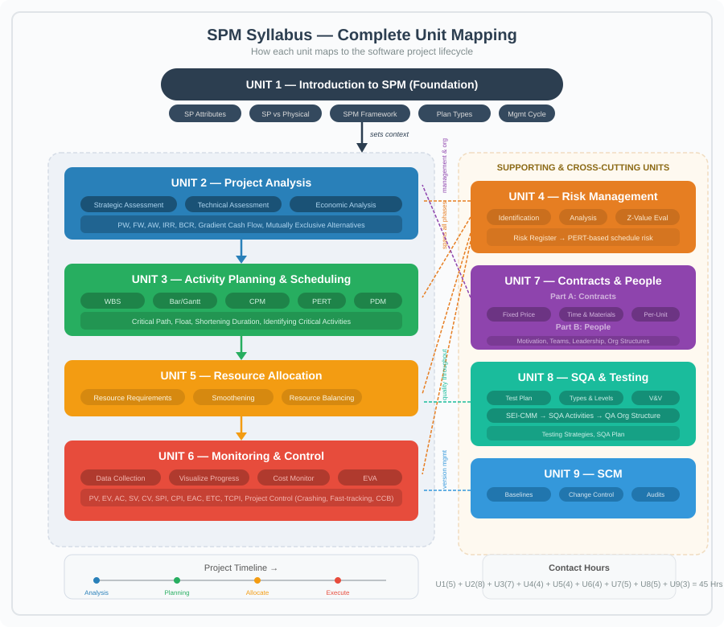
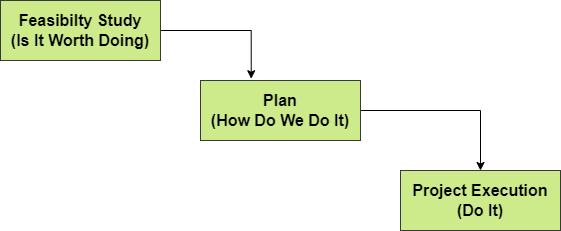
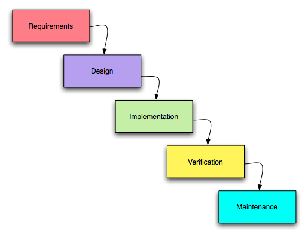
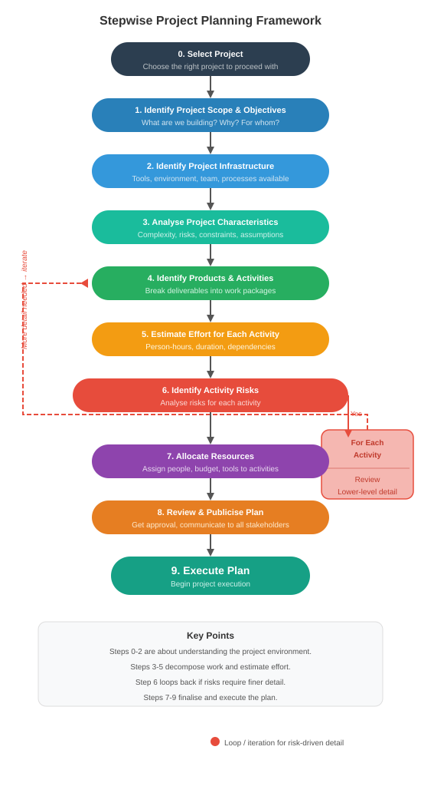

# ## **Chapter 1: INTRODUCTION TO SOFTWARE PROJECT MANAGEMENT**

**Figure: Syllabus Overview — Where Each Unit Fits**


---

### **1. Software Engineering Problem and Software Product, Software Product Attributes**

**Software Engineering Problem**

The core difficulty: software is invisible, highly complex, must conform to changing human rules, and is very easy to alter. These flow directly from the product's attributes.

**Software Product Attributes → Problems**

| **Attribute** | **Meaning** | **Resulting Problem** |
| --- | --- | --- |
| **Invisibility** | Progress and structure cannot be seen. *(e.g., you can’t “see” a code module’s completion % like you see a bridge pillar)* | → Poor estimates, unrealistic deadlines. |
| **Complexity** | Thousands of interacting logic paths per unit cost. *(e.g., even a small tax app has hundreds of rule combinations)* | → Incomplete specs, role confusion, hard quality measurement. |
| **Conformity** | Must fit volatile human rules and laws. *(e.g., payroll tax slabs change every budget year)* | → Moving targets, incorrect success criteria. |
| **Flexibility** | Change is cheap and easy. *(e.g., adding a “dark mode” toggle in a day)* | → Scope creep, outdated docs, baseline instability. |
| **Abstractness** | Pure thought‑stuff; no physical existence. | → Miscommunication, knowledge loss when staff leave. |
| **Intangibility of Process** | Development knowledge lives in people’s minds. | → Poor training, remote management gaps. |

---

### **2. Definition of a Software Project (SP)**

**Project** – A planned activity with:

Non-routine tasks, specific objectives, fixed time span, done for a client, multiple specialisms, phased execution, constrained resources, large/complex.

*Short contrast*:

- **Routine** → weekly server restart (not a project)
- **Project** → migrating the entire server to cloud in 3 months

**Software Project**

The whole lifecycle from early investigation to final implementation and maintenance, integrating all components (code, docs, training).

---

### **3. Software Project Vs. Other Types of Projects**

| **Aspect** | **Physical Project (e.g., road bridge)** | **Software Project (e.g., hospital management system)** |
| --- | --- | --- |
| **Visibility** | Progress visible (pillars rising). | Progress invisible (code completion not tangible). |
| **Complexity** | Governed by fixed physical laws. | Much higher logical complexity; no natural bounds. |
| **Conformity** | Must follow stable building codes. | Must follow changing laws, insurance rules, etc. |
| **Flexibility** | Changes are expensive. | Changes are easy → frequent modifications. |

---

### **4. Activities Covered by SPM**

**Figure 1: Feasibility – Plan – Execution Cycle**


**A. Feasibility Study** – Use **T‑O-E-S-L-i-P**

- **T**echnical – hardware/software available?
- **E**conomical – benefits > costs?
- **L**egal – data protection, licenses?
- **O**perational – will users accept it?
- **S**chedule – can it be done in time?
    
    *Short example*: For a food delivery app, ask: can servers handle 10,000 orders? Will revenue recover development cost within 2 years?
    

**B. Planning**

- Outline plan for the whole project; detailed plan only for immediate next stage.
- Later stages planned when closer (rolling wave).
    
    *Short example*: Phase‑1 (ordering) planned in detail now; Phase‑2 (loyalty points) detailed later, with better data.
    

**C. Project Execution**

Two sub‑phases:

- **Design** → UI, architecture, database.
- **Implementation** → real coding, integration.

**Full Lifecycle Flow**


- Maintenance types: Corrective (bugs), Adaptive (new platforms), Perfective (new features).

---

### **5. Categorising Software Projects**

**A. Information Systems vs. Embedded Systems**

| **Information System** | **Embedded System** |
| --- | --- |
| Interfaces with an **organisation**. | Interfaces with a **machine**. |
| Business logic focus. | Real‑time control focus. |
| *Example*: Payroll system, hotel reservation. | *Example*: Car anti‑lock braking software, AC temperature controller. |

**B. Objectives‑Driven vs. Product‑Driven**

| **Objectives‑Driven** | **Product‑Driven** |
| --- | --- |
| Aim is a **goal**. | Aim is a **specified product**. |
| Alternative solutions allowed. | Exact deliverable must be built. |
| *Example*: Brightmouth College – goal is cheaper payroll; if in‑house package isn’t cheaper, they can outsource. | *Example*: A custom passport‑issuing system with exact biometric specs. |

---

### **6. Project Management Cycle and SPM Framework**

**A. The 8 Management Activities (SPM Framework)**

| **Activity** | **Meaning (short illustration)** |
| --- | --- |
| **Planning** | Decide what to do *(e.g., create sprint schedule)* |
| **Organising** | Make arrangements *(e.g., book test environment)* |
| **Staffing** | Select right people *(e.g., hire a UI designer)* |
| **Directing** | Lead and instruct *(e.g., explain module requirements to a junior dev)* |
| **Monitoring** | Check progress *(e.g., daily stand‑up)* |
| **Controlling** | Correct deviations *(e.g., add devs to a delayed module)* |
| **Innovating** | Find new solutions *(e.g., use a new caching library to fix performance)* |
| **Representing** | Liaise with clients/management *(e.g., present status to steering committee)* |

**B. Project Control Cycle**

text

```
Real World (actual work) → Data collection → Data Processing (information) → Modelling → Decisions/Plans → Implementation → (back to Real World)
```

*Simple memory*: Measure → Compare → Decide → Act → Repeat.

*Short example*: Collect sprint hours, see delay, move one feature to next sprint, implement decision, remeasure.

**Figure: Stepwise Project Planning Framework**


---

### **7. Types of Project Plan**

| **Plan Type** | **Description *(short example in parentheses)*** |
| --- | --- |
| **Quality Plan** | Quality standards, reviews, tests *(e.g., 95% unit test coverage required)* |
| **Validation Plan** | Approach for testing and acceptance *(e.g., UAT in March with real hospital staff)* |
| **Configuration Management Plan** | Version control, change control *(e.g., Git for code; signed form to change requirements)* |
| **Maintenance Plan** | Post‑delivery effort & cost *(e.g., 2 devs for 6 months to handle tax updates)* |
| **Staff Development Plan** | Team skill improvement *(e.g., junior devs attend a cloud workshop)* |

