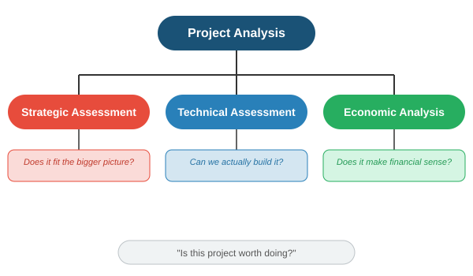
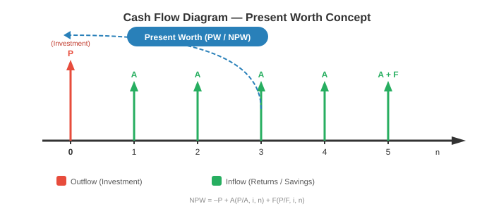
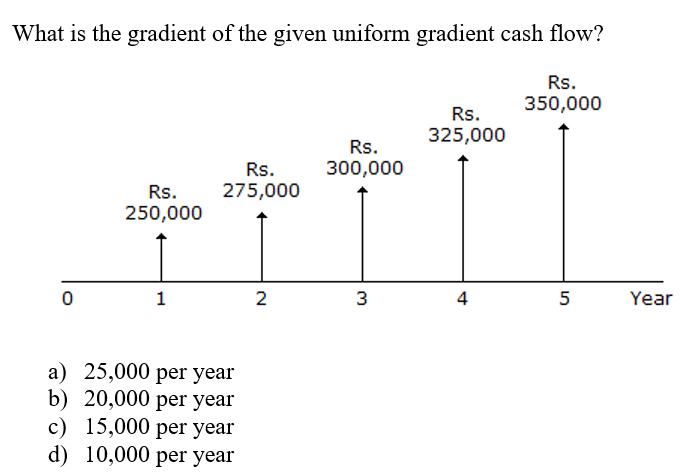

# ## **Chapter 2: PROJECT ANALYSIS (Final Revision Notes)**

---

### **1. INTRODUCTION TO PROJECT ANALYSIS**

Project analysis is the process of examining every aspect of a proposed project *before* committing resources. It answers one core question: **"Is this project worth doing?"**

It sits inside the **Feasibility Study** (from Unit 1) and breaks down into three assessments:

---

### **2. STRATEGIC ASSESSMENT**

Strategic assessment evaluates whether the project aligns with the organisation's long-term goals. A project can be technically brilliant and financially profitable, but still wrong for the company.

**Key Questions:**

- Does this project support our business strategy?
- Does it provide competitive advantage?
- Is it the right time for this project?
- What happens if we *don't* do it?

**Link from old notes (the bit that fits here):**

- Step 1.2 of project planning: "Establish a project authority" → ensures unity of purpose.
- Step 1.3: "Identify all stakeholders and their interests" → a strategic project must serve stakeholder goals.
- Step 2.1: "Identify relationship between project and strategic planning" → where does this project fit among all other projects in the organisation?

**Simple example**: A small college wants to build an AI-powered student counselling chatbot. Technically possible, financially cheap, but strategically misaligned — their real priority is fixing the broken enrolment system. Project fails strategic assessment.

---

### **3. TECHNICAL ASSESSMENT**

Technical assessment asks: **"Do we have the capability to build and run this system?"**

**Areas assessed:**

| **Area** | **Key Question** | **Risk if Not Checked** |
| --- | --- | --- |
| **Hardware** | Are servers, network, devices available? | System cannot be deployed. |
| **Software** | Do we have the required development tools, databases, licenses? | Development stalls. |
| **Skills** | Does the team have the right expertise? | Poor quality product. |
| **Infrastructure** | Does the existing IT environment support the new system? | Integration failure. |
| **Operational fit** | Will the organisation be able to use and maintain it? | System goes unused. |

**Simple example**: A project to build a mobile banking app fails technical assessment because the bank's legacy mainframe cannot expose APIs that the app needs to consume.

**Link from old notes**: Step 2.2 "Identify installation standards and procedures" → ensures technical standards are followed. Step 3.5 "Select general lifecycle approach" → technical constraints may dictate waterfall vs agile.

---

### **4. ECONOMIC ANALYSIS (The main focus)**

This is the financial mathematics part. Every method here compares **cash inflows (benefits)** vs **cash outflows (costs)** over time, accounting for the **time value of money**.

> **Core concept**: Money today is worth more than money tomorrow (because today's money can earn interest).
> 

**Glossary of symbols you'll use throughout:**

| **Symbol** | **Meaning** |
| --- | --- |
| **P** | Present worth (value at time = 0) |
| **F** | Future worth (value at time = n) |
| **A** | Annual worth (equal amount recurring each period) |
| **G** | Uniform gradient (amount increasing by constant G each period) |
| **i** | Interest rate per period (decimal form, e.g., 10% = 0.10) |
| **n** | Number of periods (usually years) |

---

### **4.1 Present Worth (PW) Analysis**

**Concept**: Convert all future cash flows (inflows and outflows) to their equivalent value *right now* (time zero). The sum is the Net Present Worth (NPW) or Net Present Value (NPV).

**Formula**:

$$
P = F(1+i)^{-n} \quad \text{(Single future amount → Present)}
$$

$$
P = A \cdot \frac{(1+i)^n - 1}{i(1+i)^n} \quad \text{(Annual series → Present)}
$$

**Decision Rule**:

- **NPW > 0** → Project is financially acceptable (earns more than minimum required return).
- **NPW < 0** → Reject.
- For comparing alternatives → choose the one with **highest positive NPW**.

**Figure: Cash Flow Diagram for Present Worth**

**Simple example**: Invest Rs 1,00,000 now (P). Get Rs 40,000 per year for 3 years (A). Interest rate 10%.

- PW of inflows = 40,000 × [(1.1³ – 1) / (0.1 × 1.1³)] = 40,000 × 2.487 = Rs 99,480
- NPW = 99,480 – 1,00,000 = **– Rs 520** → Reject (just below zero).

---

### **4.2 Future Worth (FW) Analysis**

**Concept**: Convert all cash flows to their equivalent value at the *end* of the project's life (time n). Then compare.

**Formula**:

$$
F = P(1+i)^n \quad \text{(Single present amount → Future)}
$$

$$
F = A \cdot \frac{(1+i)^n - 1}{i} \quad \text{(Annual series → Future)}
$$

**Decision Rule**:

- If FW of benefits > FW of costs → Accept.
- For comparing alternatives → choose the one with **highest net future worth**.

**Simple example**: Same project as above. Find F worth of the Rs 1,00,000 investment after 3 years at 10%.

- F of investment = 1,00,000 × (1.1)³ = 1,33,100
- F of inflows = 40,000 × [(1.1³ – 1) / 0.1] = 40,000 × 3.31 = 1,32,400
- Net FW = 1,32,400 – 1,33,100 = **– Rs 700** → Reject. (Same decision as PW, just at a different point in time.)

---

### **4.3 Annual Worth (AW) Analysis**

**Concept**: Spread all cash flows (lumpy investments and returns) into an equivalent **equal annual amount** over the project life. This makes comparison easy, especially for projects with different lifetimes.

**Formula**:

$$
A = P \cdot \frac{i(1+i)^n}{(1+i)^n - 1} \quad \text{(Present worth → Annual series)}
$$

$$
A = F \cdot \frac{i}{(1+i)^n - 1} \quad \text{(Future worth → Annual series)}
$$

**Decision Rule**:

- If Net Annual Worth > 0 → Accept.
- For comparing alternatives → choose the one with **highest equivalent annual worth**.

**Simple example**: A machine costs Rs 5,00,000 today (P), lasts 5 years, has annual maintenance cost of Rs 20,000. Interest 12%.

- Annual cost of initial investment = 5,00,000 × [ (0.12 × 1.12⁵) / (1.12⁵ – 1) ] = 5,00,000 × 0.2774 = Rs 1,38,700
- Total annual cost = 1,38,700 + 20,000 = **Rs 1,58,700 per year**.
    
    This is the uniform annual cost of owning and operating the machine.
    

---

### **4.4 Internal Rate of Return (IRR) Method**

**Concept**: The IRR is the discount rate (i) at which the **Net Present Worth becomes exactly zero**. It represents the project's actual rate of return.

**Formula (conceptual)**:

Solve for i where:

$$
\text{PW}_{\text{inflows}} - \text{PW}_{\text{outflows}} = 0
$$

This usually requires trial-and-error or interpolation:

$$
IRR = i_1 + \frac{NPW_1}{NPW_1 - NPW_2} \times (i_2 - i_1)
$$

Where: i₁ = lower rate giving positive NPW; i₂ = higher rate giving negative NPW.

**Decision Rule**:

- **IRR > Minimum Acceptable Rate of Return (MARR)** → Accept.
- **IRR < MARR** → Reject.

**Simple example**: Invest Rs 10,000 now. Get Rs 12,000 after 2 years.

- Try i = 9%: PW = –10,000 + 12,000 / (1.09)² = –10,000 + 10,100 = +100 (positive)
- Try i = 10%: PW = –10,000 + 12,000 / (1.10)² = –10,000 + 9,917 = –83 (negative)
- IRR ≈ 9% + [100 / (100 + 83)] × 1% = 9.55% → If MARR is 8%, accept.

---

### **4.5 Benefit-Cost Ratio (BCR) Analysis**

**Concept**: Ratio of all discounted benefits to all discounted costs.

**Formula**:

$$
BCR = \frac{\text{PW of Benefits}}{\text{PW of Costs}}
$$

Or equivalently:

$$
BCR = \frac{\text{Equivalent Annual Benefits}}{\text{Equivalent Annual Costs}}
$$

**Decision Rule**:

- **BCR > 1** → Benefits exceed costs → Accept.
- **BCR = 1** → Break even.
- **BCR < 1** → Reject.
- For comparing alternatives → higher BCR is generally better, but care needed when project scales differ.

**Simple example**: A road project costs Rs 50 crore today. Benefits over 10 years have a PW of Rs 70 crore.

- BCR = 70 / 50 = **1.4** → Accept. For every Rs 1 spent, society gains Rs 1.40 in value.

---

### **4.6 Uniform Gradient Cash Flow**

**Concept**: Not all recurring cash flows are equal. Some increase or decrease by a **constant amount (G)** each period. For example, maintenance costs that rise by Rs 5,000 every year.

**Figure: Uniform Gradient Cash Flow**

**Conversion formulas** (gradient to present, then to annual):

$$
P = G \cdot \frac{(1+i)^n - i n - 1}{i^2(1+i)^n} \quad \text{(Gradient series → Present Worth)}
$$

$$
A = G \cdot \left( \frac{1}{i} - \frac{n}{(1+i)^n - 1} \right) \quad \text{(Gradient series → Annual Worth)}
$$

**Decision Use**: Use these formulas to convert a gradient series into an equivalent P or A, then plug into the PW, AW, or BCR method as needed.

**Simple example**: Maintenance cost is Rs 10,000 in Year 1, increasing by Rs 2,000 each year for 5 years (G = 2,000). Interest = 10%.

- Convert the gradient to equivalent annual cost:
- A = 2,000 × [ 1/0.1 – 5 / (1.1⁵ – 1) ] = 2,000 × [ 10 – 5/0.6105 ] = 2,000 × [ 10 – 8.19 ] = 2,000 × 1.81 = Rs 3,620
- Total equivalent annual cost = Base 10,000 + Gradient equivalent 3,620 = **Rs 13,620 per year**.

---

### **4.7 Comparison of Mutually Exclusive Alternatives**

When you must choose **only one** from several options (e.g., selecting one vendor, one machine, one location), you compare them on equal footing.

**Key principle**: Compare using the **same method** and the **same time horizon**.

**Methods for comparison (in order of reliability)**:

| **Method** | **How to Apply** | **Watch Out For** |
| --- | --- | --- |
| **Net PW** | Compute NPW for each alternative. Choose the one with **highest positive NPW**. | Must use same number of periods. If lives differ, use least common multiple (LCM) or AW instead. |
| **Annual Worth** | Compute AW for each alternative. Choose the one with **best AW** (highest for benefits, lowest for costs). | This is the cleanest method when alternatives have different lives — no need for LCM. |
| **IRR** | Compute IRR for each. The one with highest IRR may not be the best NPW choice. Use **Incremental IRR** analysis: compare the difference between two projects. | Never rank by IRR alone. Always do incremental analysis. |
| **BCR** | Compute BCR for each. Higher is better, but scale matters. | A tiny project can have a huge BCR but tiny absolute benefit. Use alongside NPW. |

**Step-by-step: Incremental IRR (when two projects have different IRRs)**

1. Order alternatives from lowest to highest initial cost.
2. Compute IRR of the cheaper one. If IRR > MARR, it qualifies as baseline.
3. Compute the **incremental cash flows**: (Costlier – Cheaper) for each year.
4. Compute IRR of the incremental cash flows.
5. If **Incremental IRR > MARR** → choose the costlier one (extra investment is justified).
6. If **Incremental IRR < MARR** → choose the cheaper one.

**Simple example**: Two machines, MARR = 10%.

- Machine A: Cost 1,00,000; Annual saving 20,000; Life 5 years.
- Machine B: Cost 1,50,000; Annual saving 32,000; Life 5 years.
- Incremental cost: 50,000; Incremental saving: 12,000/year.
- Find IRR of incremental: Try i = 20%: PW = –50,000 + 12,000 × [(1.2⁵–1)/(0.2×1.2⁵)] = –50,000 + 12,000 × 2.99 = –50,000 + 35,880 = –14,120 (negative). Try i = 6%: PW = –50,000 + 12,000 × 4.212 = +544 (positive).
- Incremental IRR ≈ 6.5%. Since 6.5% < MARR (10%), the extra investment in B is NOT justified → **Choose Machine A**.

