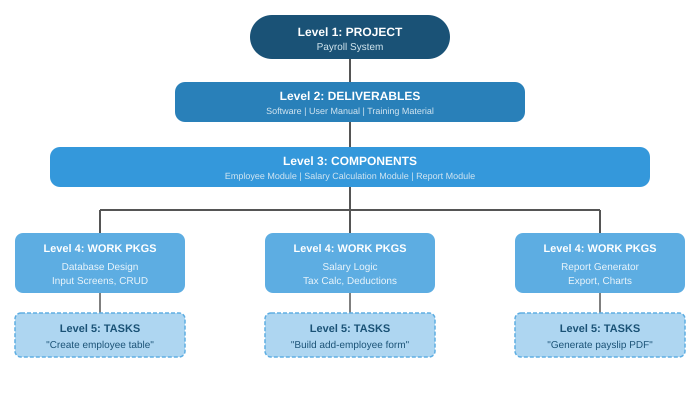
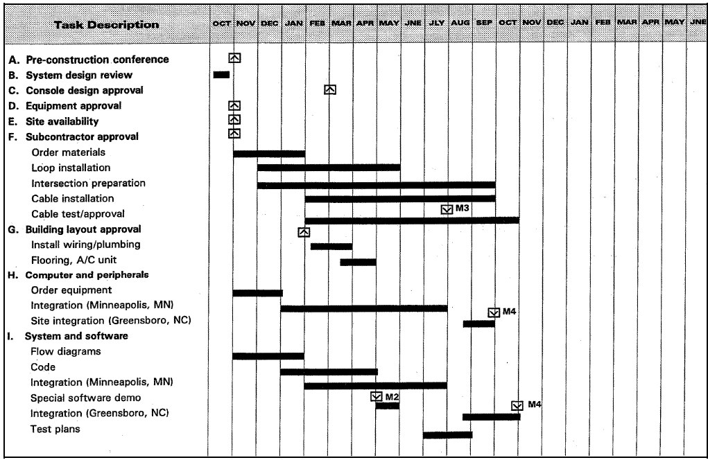
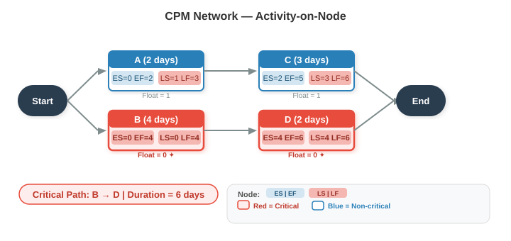
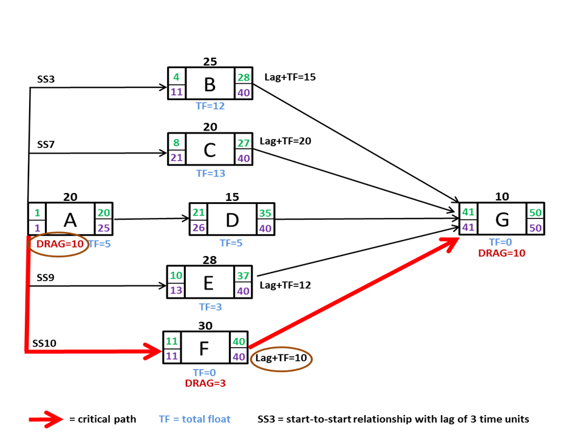

# ## **Chapter 3: ACTIVITY PLANNING AND SCHEDULING**

---

### **1. OBJECTIVES OF ACTIVITY PLANNING**

Activity planning tells you **what to do, when to do it, and in what order**. The main objectives are:

| **Objective** | **What it means** | **Simple example** |
| --- | --- | --- |
| **Feasibility assessment** | Is the project possible within the given time and resource limits? | Can we deliver the library management system before the new academic session? |
| **Resource allocation** | What resources (people, equipment) are needed and when? | Need two Java developers in Phase 2, not from day one. |
| **Detailed costing** | How much will the project cost, and when will we spend the money? | Pay licences in Month 1, pay testers in Month 4. |
| **Motivation** | Clear targets with deadlines motivate the team, especially if they helped set those targets. | Developer commits to finishing the login module by Friday. |
| **Co-ordination** | When do different teams or departments need to be available and when can they leave? | Database team needed from Week 2 to Week 5; then they move to another project. |

> **Key idea**: Planning is not a one-time event. It is an ongoing process — you refine the plan as you get more information.
> 

---

### **2. WORK BREAKDOWN STRUCTURE (WBS)**

**Definition**: A hierarchical decomposition of the entire project scope into smaller, manageable pieces. The lowest level is called a **work package** — small enough to assign to a single person or small team.

**Structure** (IBM’s 5-level approach, from old notes):



*Simple example – Payroll Project:*

- Level 1: Payroll System
    - Level 2: Software, User Manual, Training Material
        - Level 3 (Software): Employee Module, Salary Calculation Module, Report Module
            - Level 4 (Employee Module): Database design, Input screens, CRUD operations
                - Level 5: "Create employee table", "Build add-employee form"

**Why WBS is essential**:

- It identifies *all* activities needed (nothing is forgotten).
- It helps estimate effort, assign responsibilities, and track progress.
- It is the foundation for building the schedule and network model.

> **Note**: Activity planning can also start from a Product Breakdown Structure (PBS) and Product Flow Diagram (PFD), but WBS is the most common and the one your syllabus explicitly names. Think of WBS as the skeleton of your plan.
> 

---

### **3. BAR CHART (GANTT CHART)**

A bar chart is a simple visual schedule. Activities are listed down the left, a time scale runs across the top, and horizontal bars show the start and end of each activity.

**Figure: Basic Bar Chart (Gantt Chart)**


text

```
Activity       | Week 1 | Week 2 | Week 3 | Week 4 | Week 5 |
---------------|--------|--------|--------|--------|--------|
A: Requirements|████████|        |        |        |        |
B: Design      |        |████████|        |        |        |
C: Coding      |        |        |████████|████    |        |
D: Testing     |        |        |        |  ██████|████    |
```

**Advantages**:

- Very easy to understand.
- Good for communicating the schedule to stakeholders.
- Shows start, end, and duration at a glance.

**Limitations**:

- Does **not** clearly show dependencies between activities (e.g., B depends on A).
- Does not show which activities are critical.

That is why we move to network models.

---

### **4. NETWORK PLANNING MODELS**

Network models represent activities and their dependencies as a graph. They allow us to calculate timings and find the **critical path**.

The three models you must know:

| **Model** | **Key Characteristic** |
| --- | --- |
| **CPM** (Critical Path Method) | Deterministic – activity durations are known, single values. |
| **PERT** (Program Evaluation & Review Technique) | Probabilistic – activity durations are uncertain, use three time estimates. |
| **PDM** (Precedence Diagramming Method) | Uses nodes for activities and allows **four types of dependencies** with lags. |

---

### **4.1 Critical Path Method (CPM)**

**When to use**: Routine projects where activity times are known from past experience.

**Key terms for each activity**:

| **Symbol** | **Meaning** | **Obtained by** |
| --- | --- | --- |
| **ES** | Earliest Start | Forward Pass |
| **EF** | Earliest Finish | ES + Duration |
| **LS** | Latest Start | Backward Pass |
| **LF** | Latest Finish | LS + Duration |
| **Float (Slack)** | Amount of delay allowed without delaying the project | $LS - ES$ (or $LF - EF$) |
| **Critical Path** | The path through the network where **Float = 0** for all activities | After forward & backward pass |

**Steps to apply CPM**:

1. List all activities and their durations.
2. Draw the network diagram (Activity-on-Node or Activity-on-Arrow). For simplicity, we use **Activity-on-Node** (each node is an activity, arrows show dependencies).
3. **Forward Pass** – Calculate ES and EF for every activity.
    - ES of first activity = 0.
    - EF = ES + Duration.
    - For a successor: ES = maximum EF of all its predecessors.
4. **Backward Pass** – Calculate LF and LS.
    - LF of last activity = its EF (or project deadline).
    - LS = LF – Duration.
    - For a predecessor: LF = minimum LS of all its successors.
5. Compute Float = LS – ES for each activity.
6. Identify the Critical Path: all activities with Float = 0.

**Figure: Simple CPM Network (Activity-on-Node)**


text

```
     [A]        [C]
    (2 days)   (3 days)
   /           \
Start --        >-- End
   \           /
    [B]       [D]
   (4 days)  (2 days)
```

*Precedence*: A must finish before C; B must finish before D; C and D finish the project.

**Example Calculation**:

Activity durations: A=2, B=4, C=3, D=2.

- Forward pass:
    - A: ES=0, EF=2
    - B: ES=0, EF=4
    - C: ES=EF(A)=2, EF=2+3=5
    - D: ES=EF(B)=4, EF=4+2=6
    - Project EF = max(5,6) = 6 days.
- Backward pass (project LF=6):
    - D: LF=6, LS=6-2=4
    - C: LF=6, LS=6-3=3
    - B: LF=LS(D)=4, LS=4-4=0
    - A: LF=LS(C)=3, LS=3-2=1
- Float: A: 1-0=1 (non-critical). B: 0-0=0 (critical). C: 3-2=1 (non-critical). D: 4-4=0 (critical).
- **Critical Path**: **B → D**. Project duration = 6 days.

---

### **4.2 Program Evaluation and Review Technique (PERT)**

**When to use**: Projects with uncertainty, where activity durations are hard to predict (e.g., R&D projects).

**Three time estimates per activity**:

| **Estimate** | **Symbol** | **Meaning** |
| --- | --- | --- |
| Optimistic | O | Best-case scenario, everything goes right. |
| Most Likely | M | Normal conditions, most realistic. |
| Pessimistic | P | Worst-case scenario, everything goes wrong. |

**Formulas**:

$$
TE = \frac{O + 4M + P}{6} \quad \text{(Expected Time)}
$$

$$
\sigma = \frac{P - O}{6} \quad \text{(Standard Deviation)}
$$

$$
\sigma^2 = \left(\frac{P - O}{6}\right)^2 \quad \text{(Variance)}
$$

**Project duration and probability**:

- Project expected time = Sum of TE along the critical path.
- Project variance = Sum of variances along the critical path.
- To find probability of finishing within a target deadline T:

$$
Z = \frac{T - TE_{\text{project}}}{\sqrt{\sigma^2_{\text{project}}}}
$$

Look up Z in the standard normal distribution table. A Z=1.0 means ~84% probability; Z=0 means 50%.

**Simple example**: Activity X: O=3, M=5, P=13

- TE = (3 + 4×5 + 13)/6 = (3+20+13)/6 = 36/6 = 6 days.
- σ = (13-3)/6 = 10/6 ≈ 1.67 days.
- If X is the only critical activity, probability of finishing in 7 days: Z = (7-6)/1.67 ≈ 0.6 → ~73%.

> **Exam tip**: CPM is deterministic (single duration), PERT is probabilistic (three estimates). Use CPM when past data exists, PERT when there is high uncertainty.
> 

---

### **4.3 Precedence Diagramming Method (PDM)**

PDM is a more flexible network model used by modern scheduling software (e.g., MS Project). It uses **Activity-on-Node** representation and allows **four types of dependencies** (relationships) with **lags**.

**Four Dependency Types**:

| **Type** | **Abbreviation** | **Meaning** | **Example** |
| --- | --- | --- | --- |
| **Finish-to-Start** | FS | Successor cannot start until predecessor finishes (standard CPM relationship). | Testing (B) cannot start until coding (A) finishes. |
| **Start-to-Start** | SS | Successor cannot start until predecessor has started (with possible lag). | Design documentation (B) can start 2 days after design (A) has started. |
| **Finish-to-Finish** | FF | Successor cannot finish until predecessor finishes (with possible lag). | System integration (B) cannot finish until module testing (A) finishes + 1 day for final checks. |
| **Start-to-Finish** | SF | Successor cannot finish until predecessor starts (rare). | Security guard duty (B) cannot finish until night shift (A) starts. |

**Lags**: A positive or negative time offset applied to a dependency.

- **+ Lag**: A delay (e.g., “start B 3 days after A finishes”).
- **– Lag (lead)**: An overlap (e.g., “start B 2 days before A finishes”).

**Figure: PDM with SS + Lag**


text

```
[A: Design] ----(SS + 2 days)----> [B: Write User Manual]
```

Meaning: B (manual writing) can start 2 days after A (design) has started.

**Why PDM is important**:

- Reflects real-world overlaps (e.g., coding can start before design is 100% complete).
- Much more realistic than simple Finish-to-Start only.
- Used in almost all professional project scheduling tools today.

---

### **5. IDENTIFYING CRITICAL ACTIVITIES**

**Critical activities** are those that **directly affect the project end date**. Any delay in a critical activity delays the whole project.

**How to identify**:

1. Perform forward and backward pass (CPM or PERT) for each activity.
2. Calculate **Total Float** = LS – ES.
3. Activities with **Total Float = 0** are critical.
4. The sequence of critical activities forms the **Critical Path**.

*From the CPM example earlier*:

- A: Float = 1 → not critical.
- B: Float = 0 → **critical**.
- C: Float = 1 → not critical.
- D: Float = 0 → **critical**.
- Critical path: B → D.

**Why this matters**:

- You know exactly where to focus management attention.
- If you need to shorten the project, you must shorten critical activities first.
- Non-critical activities have some slack — they can be delayed without harming the project end date (within their float).

---

### **6. SHORTENING PROJECT DURATION**

When the calculated project end date is too late, you must compress the schedule. Two main methods:

**A. Crashing**

- Add extra resources to critical activities to reduce their duration.
- **Cost increases**, but time decreases.
- Works only for activities that can be sped up by adding people/equipment (not all activities are "crashable" — e.g., "waiting for concrete to cure").
- Always recalculate the critical path after crashing, because a new path may become critical.

*Simple example*: A critical coding activity takes 10 days with 1 developer. Adding a second developer might reduce it to 6 days, but at extra cost.

**B. Fast-Tracking**

- Overlap activities that were originally planned in sequence (i.e., start a successor before the predecessor finishes).
- **Risk increases** (rework may be needed if predecessor changes), but time decreases.
- Often implemented using PDM with negative lags or SS dependencies.

*Simple example*: Start testing modules while the remaining modules are still being coded, instead of waiting for all coding to finish.

**General process**:

1. Identify the critical path.
2. Examine which critical activities can be crashed or overlapped.
3. Pick the most cost-effective and risk-manageable option.
4. Update the network and repeat if necessary.

---

