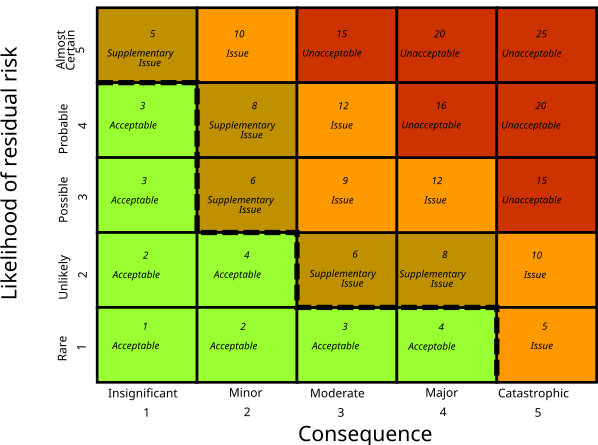

# ## **Chapter 4: RISK MANAGEMENT**

---

### **1. INTRODUCTION TO RISK MANAGEMENT**

**Risk** – The possibility that something will happen that harms the project’s objectives (time, cost, quality).

**Risk Management** – A systematic process of identifying, analysing, and controlling risks before they become problems.

It answers three core questions:

- What can go wrong?
- How likely is it, and how bad will it be?
- What can we do about it?

---

### **2. NATURE OF RISK**

Understanding the nature of risk helps you categorise and respond to it correctly.

| **Aspect** | **Explanation** | **Simple Example** |
| --- | --- | --- |
| **Risk vs. Uncertainty** | Risk = you can predict probability and impact. Uncertainty = you cannot even guess. | Risk: 30% chance a key developer leaves (known event). Uncertainty: a new technology might appear next year and make your project obsolete. |
| **Negative vs. Positive Risk** | Most risks are threats (negative). Some are opportunities (positive). | Threat: server delivery delayed. Opportunity: a new tool could reduce testing time. |
| **Known vs. Unknown Risks** | Known = identified in advance. Unknown = emerge unexpectedly. | Known: integration bugs. Unknown: sudden regulatory change. |
| **Business vs. Project Risk** | Business: risk to the organisation’s benefit. Project: risk to project delivery. | Business: product may not sell. Project: missing a deadline. |
| **Common Software Project Risks** | High-level categories: personnel, technology, requirements, estimation, organisational. | New tech stack causing delays, client keeps changing requirements. |

---

### **3. IDENTIFICATION OF RISK**

This is the first practical step: find as many potential risks as possible.

**Common Identification Techniques**:

| **Technique** | **How It Works** | **Simple Example** |
| --- | --- | --- |
| **Brainstorming** | Team generates risks freely, no criticism. | Team lists everything that could go wrong with the new payroll system. |
| **Checklists** | Use a standard list of common software project risks. | Checklist item: "Are requirements stable?" |
| **Interviews** | Talk to experts, stakeholders, and experienced project managers. | Ask a senior architect about technical risks. |
| **SWOT Analysis** | Identify Strengths, Weaknesses, Opportunities, Threats. | Weakness: team inexperienced with cloud tech → risk. |
| **Assumption Analysis** | List all project assumptions and check what happens if they are wrong. | Assumption: third-party API will be ready by March. If not → delay. |
| **Diagramming** | Cause-and-effect (fishbone) diagrams to trace root causes. | Effect: project late. Causes: unclear specs, sick developer, slow hardware. |

**Risk Register (Output of Identification)**

A document listing every identified risk, its description, probability, impact, owner, and planned response. It is a living document updated throughout the project.

*Simple example entry:*

text

```
Risk ID: R01
Description: Lead developer may leave in the middle of coding.
Probability: Medium
Impact: High
Owner: Project Manager
Response: Cross-train another developer; maintain documentation.
```

---

### **4. RISK ANALYSIS**

After identification, we analyse each risk to prioritise it: **Probability × Impact**.

**A. Qualitative Risk Analysis**

Subjective, quick, uses descriptive scales.

| **Probability Scale** | **Impact Scale** |
| --- | --- |
| Low – Medium – High | Low – Medium – High |
| Very Low, Low, Moderate, High, Very High (1-5) | Same levels |

**Probability-Impact Matrix**


text

```
              Impact
              Low    Medium   High
Probability
High          Medium  High     Critical
Medium        Low     Medium   High
Low           Very Low Low     Medium
```

- **Critical/High**: Must act immediately.
- **Medium**: Monitor and plan response.
- **Low**: Accept or watch.

**B. Quantitative Risk Analysis**

Uses numbers. Tools include:

- **Expected Monetary Value (EMV)**: $EMV = \text{Probability} \times \text{Impact Cost}$.
    - Example: 20% chance of a Rs 5,00,000 loss → EMV = 0.2 × 500,000 = Rs 1,00,000.
- **Decision Trees**: Map different scenarios and their payoffs.
- **Schedule risk analysis using Z-values** (next section).

---

### **5. EVALUATION OF RISK TO THE SCHEDULE USING Z-VALUES**

This is a quantitative technique to answer: **"What is the probability that the project will miss its target deadline?"**

It comes directly from the **PERT** method (Unit 3). Instead of just one deterministic schedule, PERT gives us the project’s expected time (TE) and its variance. We can then use the **Z-value** to find the probability of finishing by any given deadline.

**Step-by-Step Process**:

1. For each activity on the critical path, have the three PERT estimates: Optimistic (O), Most Likely (M), Pessimistic (P).
2. Calculate **Expected Time (TE)** and **Variance (σ²)** for each critical activity:

    $$
    TE = \frac{O + 4M + P}{6}
    $$

    $$
    \sigma^2 = \left(\frac{P - O}{6}\right)^2
    $$
    
3. Calculate the **Project TE** = sum of TE of all critical activities.
4. Calculate the **Project Variance** = sum of σ² of all critical activities.
5. Compute the **Project Standard Deviation** = √(Project Variance).
6. For a target deadline **T**, calculate the **Z-value**:

    $$
    Z = \frac{T - TE_{\text{project}}}{\sigma_{\text{project}}}
    $$
    
7. Interpret Z using the standard normal distribution table (or remember key thresholds):
    - Z = 0 → 50% chance of finishing by T.
    - Z > 0 → more than 50% chance (project ahead or on time relative to target).
    - Z < 0 → less than 50% chance (project behind).

**Simple Example**:

A project has only two critical activities with the following estimates:

| **Activity** | **O** | **M** | **P** | **TE** | **σ²** |
| --- | --- | --- | --- | --- | --- |
| A | 5 | 10 | 15 | 10 | ((15-5)/6)² = (10/6)² ≈ 2.78 |
| B | 8 | 12 | 22 | 13 | ((22-8)/6)² = (14/6)² ≈ 5.44 |
- Project TE = 10 + 13 = 23 days.
- Project Variance = 2.78 + 5.44 = 8.22
- Project Standard Deviation = √8.22 ≈ 2.87 days.

The client demands completion in 25 days. What is the risk of exceeding 25 days?

text

```
Z = (25 - 23) / 2.87 ≈ 0.70
```

From normal table, Z=0.70 → ~75.8% probability of finishing **on or before** 25 days.

So the risk of **exceeding** 25 days = 100% – 75.8% ≈ **24.2%**.

If the target was 20 days:

text

```
Z = (20 - 23) / 2.87 ≈ -1.04 → ~15% probability of meeting deadline, 85% risk of delay.
```

**Why This Matters for Risk Management**:

- It turns schedule uncertainty into a numeric risk statement.
- You can decide if the probability of meeting a deadline is acceptable.
- If not acceptable, you must reduce risk (add resources, change scope, etc.).

**Exam Tip**: The Z-value method is the bridge between Unit 3 (PERT) and Unit 4 (Risk). You will likely have a numerical problem linking both

