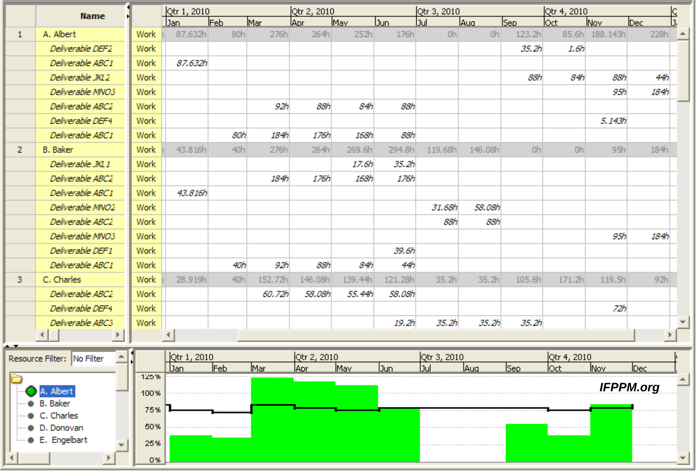

# ## **Chapter 5: RESOURCE ALLOCATION**

---

### **1. IDENTIFYING RESOURCE REQUIREMENTS**

Before you can allocate resources, you must identify **what** you need, **when**, and at **what level**.

**What is a Resource?**

Anything required to carry out project activities:

- **People** (developers, testers, designers, managers)
- **Equipment** (servers, laptops, software licences)
- **Materials** (cloud credits, test data)
- **Facilities** (office space, test lab)

**How to Identify Resource Requirements (Per Activity)**

For each activity in the WBS, specify:

| **Attribute** | **Meaning** | **Simple Example** |
| --- | --- | --- |
| **Work amount** | How much work (person-days, units) | 5 person-days to code login module |
| **Skill/experience level** | Minimum capability needed | Mid-level Java developer |
| **Complexity** | How difficult the task is (scale 1-5) | Complexity: 3 |
| **Task category** | Unskilled / Skilled / Expert / Leadership / Management | Category: Skilled |
| **Timing** | When the resource is needed (driven by activity ES/LS dates) | Needed in Week 3-4 |

**Who Does This?**

The **Project Manager** is responsible. Priority is given to resources that are **scarce or hard to find** (e.g., senior developers) — these must be planned far in advance.

---

### **2. RESOURCE ALLOCATION**

Resource allocation is the process of **assigning identified resources to project activities** in a way that respects both activity dependencies and resource constraints.

**Key Inputs**:

- Activity list with durations (from CPM/PERT)
- Resource requirements per activity
- Resource availability (who is free and when)

**Key Outputs (Three Schedules)**:

| **Schedule** | **Contents** |
| --- | --- |
| **Activity Schedule** | Planned start and finish date for each activity |
| **Resource Schedule** | Dates on which each resource is needed, and at what level |
| **Cost Schedule** | Planned cumulative expenditure over time |

**Prioritisation Techniques (Which activity gets the resource first?)**

When resources are limited, you must decide which activity gets priority.

**A. Total Float Priority**

- Activities with the **smallest total float** get resources first.
- Float = LS – ES (from CPM).
- Critical activities (float = 0) get highest priority.
- *Logic*: The least flexible activities must be protected.

**B. Ordered List Priority (Burman's Priority List)**

- Order of allocation:
    1. Shortest critical activity
    2. Other critical activities
    3. Shortest non-critical activity
    4. Non-critical activity with least float
    5. Remaining non-critical activities

**Important Consideration: Resource Allocation Can Change the Critical Path**

- Delaying an activity because a resource is unavailable eats up its float.
- Once float becomes zero, a new critical path can form.
- This is called a **resource-constrained critical path**.

**Figure: Resource Histogram**


text

```
People
   |
 5 |           ████████
 4 |       ████        ████
 3 |   ████                ████
 2 |███                        ████
 1 |                                ██
   |____________________________________ Week
        1    2    3    4    5    6    7
```

A resource histogram shows **how many people (or units of a resource) are needed each week**. White bars = scheduled work; shaded bars = float period.

---

### **3. RESOURCE SMOOTHENING**

**Definition**: Adjusting the start dates of non-critical activities (within their float) to **reduce peaks and troughs** in resource demand — **without** changing the project end date.

**Goal**: Achieve a more even, predictable resource usage profile.

**What you do**:

- Move a non-critical activity later (or earlier) within its available float.
- This shifts its resource demand to a less busy period.

**Simple Example**:

text

```
Before smoothening:            After smoothening:
Week 2: 3 devs (peak)           Week 2: 2 devs
Week 3: 1 dev                   Week 3: 2 devs
Week 4: 1 dev                   Week 4: 2 devs
```

Activity B has 2 weeks of float. It was scheduled in Week 2, but we delay it to Week 3. The peak drops from 3 to 2.

**Key Points**:

- Uses **only float** — the critical path and project end date remain unchanged.
- Ideal for situations where hiring/firing is expensive or you want stable team sizes.
- The resource histogram becomes flatter.

---

### **4. RESOURCE BALANCING (RESOURCE LEVELLING)**

**Definition**: When resource supply is **strictly limited**, you may need to delay activities **beyond their float** to stay within the resource limit. This **can** extend the project end date.

**Goal**: Ensure resource demand never exceeds available supply.

**What you do**:

- If two activities need the same scarce resource at the same time, and both are critical or have no float left, you must delay one — even if it means the project takes longer.

**Simple Example**:

text

```
Available: 2 Java developers maximum.
Week 3 demand: Activity P needs 1 dev, Activity Q needs 1 dev, Activity R needs 1 dev → 3 devs required.
Activity R has zero float (critical). You must delay one activity beyond its float.
Result: Project end date shifts by the delay.
```

**Resource Smoothing vs. Resource Balancing**

| **Aspect** | **Resource Smoothing** | **Resource Balancing** |
| --- | --- | --- |
| **Uses float** | Yes, only within available float | No, may exceed float |
| **Project end date** | Unchanged | May be extended |
| **Constraint** | Flatten resource usage | Hard limit on resource availability |
| **Priority** | Aesthetic/efficiency | Feasibility — must stay within resource cap |
| **When to use** | Resources flexible, want stability | Resources fixed, project must fit them |

---

### **5. ADDITIONAL POINTS (FROM OLD NOTES, STILL RELEVANT)**

**Human Resource Scheduling Issues**

When scheduling people, account for:

- Planned leave, public holidays
- Possible sick leave (unpredictable)
- Motivation and enthusiasm for the task (affects output)
- Workload and stress levels
- Stress outside work

**Resource Allocation Principles (Being Specific)**

- **Availability** – Is the person free when needed?
- **Criticality** – Assign experienced staff to critical path activities (reduces overrun risk).
- **Risk** – Assign best staff to highest-risk activities.
- **Training** – Assign junior staff to non-critical activities with slack, so they can learn.
- **Team Building** – Consider how individuals will work together as a team.

**Cost Categories**

- **Staff costs**: Salaries, social security, pension, holiday pay.
- **Overheads**: Office space, interest, travel, insurance.
- **Usage charges**: External contractors, leased equipment.

