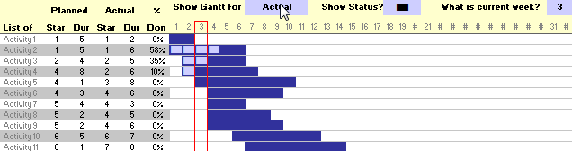
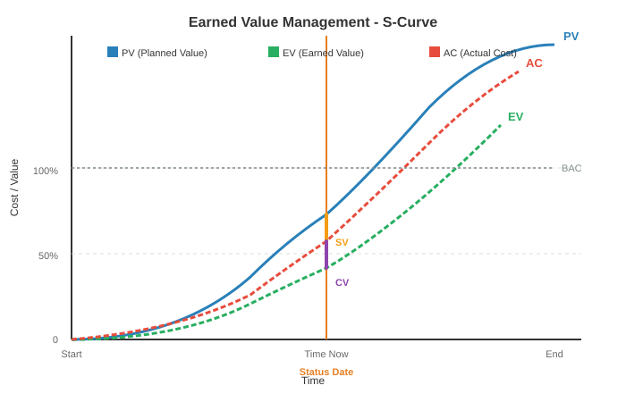
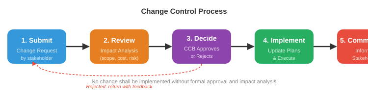

# ## **Chapter 6: MONITORING AND CONTROL**

---

### **1. INTRODUCTION**

Once the project is underway, the focus shifts from planning to **ensuring progress**.

Monitoring and control is a continuous cycle:

**Figure: Project Control Cycle**


**Simpler memory**: Measure → Compare → Decide → Act → Repeat.

**Purpose**:

- Track actual progress against the plan.
- Identify deviations early.
- Take corrective action to bring the project back on track.

**Checkpoints**: Essential to set review points in the activity plan.

- **Regular** (e.g., monthly review)
- **Event-driven** (e.g., upon completion of a key deliverable like a design document)

---

### **2. COLLECTING DATA**

Good control needs reliable, timely data.

**What to collect**:

- Actual start and finish dates of activities.
- Effort expended (person-hours/days).
- Estimate of remaining work (how much is left?).
- Issues and risks encountered.

**How to collect**:

| **Method** | **Description** | **Simple Example** |
| --- | --- | --- |
| **Weekly time sheets** | Staff record hours spent on each activity. | Developer logs 8 hours on module coding. |
| **Progress meetings** | Short, regular team meetings (e.g., Monday morning) to review what was done and what's next. | Each member reports: "Login module coding done, testing module starting." |
| **Partial completion reporting** | For long tasks, break into measurable sub-products and count completed items. | Number of screen layouts finished out of total 20. |
| **Traffic Light (RAG) reporting** | Instead of guessing % complete, team members give a colour status. | Green: on target. Amber: delayed but recoverable. Red: seriously off track, needs help. |

**Traffic Light Method Steps**:

1. Identify key (first-level) elements of work.
2. Break each into second-level constituent elements.
3. Assess each second-level element: Green / Amber / Red.
4. Review to arrive at first-level and overall assessment.

*Why use Traffic Light?* It avoids the false precision of "90% complete" and highlights problems early.

**Priority for Monitoring**: You cannot monitor everything equally. Prioritise:

- **Critical path activities** (delay = project delay)
- **Activities with no free float** (delay disrupts resource schedule)
- **High-risk activities** (most likely to overrun)
- **Activities using critical (scarce/expensive) resources**

---

### **3. VISUALIZING PROGRESS**

Raw data is hard to interpret. Visual tools make progress clear.

**A. Gantt Chart (Updated)**

- Original Gantt bars show planned dates.
- Add a second bar (or fill) to show actual progress.
- A "today" marker indicates current status.

**B. Slip Chart**

- A more striking variant of Gantt.
- As activities slip, the bar bends or extends to the right.
- The **more the slip line bends**, the greater the variation from the plan.

**Figure: Slip Chart Concept**


text

```
Activity A: Planned  |████████████|
             Actual  |██████████████░░░░|  (slipped by 2 weeks)
```

**C. Ball Chart**

- A very visual way of showing target vs. actual dates.
- Each activity has a circle containing:
    - Original schedule date
    - Revised target date (if any) or actual date when completed
- Only two dates ever appear: original + most recent target, or original + actual.
- Colour or shading indicates status (e.g., filled circle = completed).

*Simple example*:

text

```
Circle for "Design" shows:  "10 Mar / 15 Mar" (original / revised target)
Once completed, it shows:   "10 Mar / 17 Mar" (original / actual)
```

---

### **4. COST MONITORING**

Tracking what you are spending versus what you planned to spend.

**Components of cost**:

- Staff costs (salaries, benefits)
- Overheads (office, utilities, insurance)
- Usage charges (external contractors, rented equipment)

**Approach**:

- Record **actual expenditure** per time period (weekly/monthly).
- Compare against the **planned cumulative cost curve** (baseline).
- If actual spending is above the planned line, investigate why (overspending or work ahead of schedule?).

**Cost monitoring is not enough alone**: You could be under budget but behind schedule. That is why we need **Earned Value Analysis**.

---

### **5. EARNED VALUE ANALYSIS (EVA)**

EVA integrates **scope, schedule, and cost** into a single monitoring system. It tells you not just "how much did I spend?" but "how much value did I get for that spend?"

**Core Three Metrics**:

| **Metric** | **Full Name** | **Meaning** | **Simple Analogy** |
| --- | --- | --- | --- |
| **PV** | Planned Value | The budgeted cost of work that was **planned** to be done by now. | The road should have been 10 km by today (costing Rs 10 lakh). |
| **EV** | Earned Value | The budgeted cost of work **actually completed** by now. | The road is only 8 km, so value earned = 8 lakh. |
| **AC** | Actual Cost | The money **actually spent** to achieve the completed work. | You spent Rs 12 lakh to build that 8 km. |

**Derived Variances and Indices**:

| **Metric** | **Formula** | **Meaning** | **Interpretation** |
| --- | --- | --- | --- |
| **SV** (Schedule Variance) | $EV - PV$ | Are we ahead or behind schedule? | + good, – bad |
| **CV** (Cost Variance) | $EV - AC$ | Are we under or over budget? | + good, – bad |
| **SPI** (Schedule Performance Index) | $EV / PV$ | Schedule efficiency. | >1 ahead, <1 behind |
| **CPI** (Cost Performance Index) | $EV / AC$ | Cost efficiency. | >1 under budget, <1 over |

**Simple Example**:

- Planned: 4 modules in 4 weeks, budget Rs 4,00,000 (PV at Week 4 = 4,00,000).
- Actually completed: 3 modules (EV = 3,00,000).
- Actually spent: Rs 3,50,000 (AC = 3,50,000).
- SV = 3,00,000 – 4,00,000 = **–1,00,000** → behind schedule.
- CV = 3,00,000 – 3,50,000 = **–50,000** → over budget.
- SPI = 3/4 = 0.75 (<1, slow).
- CPI = 3,00,000/3,50,000 ≈ 0.86 (<1, spending more than earning).

**Forecasting with EVA**:

| **Forecast** | **Formula** | **Meaning** |
| --- | --- | --- |
| **EAC** (Estimate at Completion) | $BAC / CPI$ | What will the total project cost if current cost performance continues? |
| **ETC** (Estimate to Complete) | $EAC - AC$ | How much more money will be needed? |
| **TCPI** (To-Complete Performance Index) | $(BAC - EV) / (BAC - AC)$ | What CPI must we achieve on remaining work to stay within budget? |

*Where BAC = Budget at Completion (original total budget).*

*Continuing the example*: BAC = 4,00,000

- EAC = 4,00,000 / 0.86 ≈ Rs 4,65,116 (project will overrun by ~65,000).
- ETC = 4,65,116 – 3,50,000 = Rs 1,15,116 needed to finish.

**Figure: EVA S-Curve (PV, EV, AC over time)**


**Why EVA is Powerful**:

- Early warning system: SPI and CPI tell you the health of the project long before the deadline.
- Combines time and cost in one view.
- Enables realistic forecasting of final cost and completion date.

---

### **6. PROJECT CONTROL**

Once monitoring reveals a deviation, **control** action is taken to bring the project back on target.

**A. Shortening the Critical Path**

If the project is behind schedule, focus on critical activities (non-critical ones have float).

- **Crashing**: Add extra resources to critical tasks (cost increases, time reduces).
- **Fast-tracking**: Overlap critical tasks that were originally sequential (risk increases).

**B. Reconsider the Precedence Network**

- If shortening individual critical activities is not enough, re-examine dependencies.
- Can some Finish-to-Start constraints be relaxed? (e.g., start testing before all coding is complete).
- This is essentially revisiting the schedule logic.

**C. Change Control**

When requests for change come (and they will), a formal process prevents chaos.

1. **Submit** – Stakeholder requests a change.
2. **Review** – Project team assesses impact on scope, schedule, cost, and risk.
3. **Decide** – Change Control Board approves or rejects.
4. **Implement** – If approved, plans and schedules are updated, and the change is executed.
5. **Communicate** – All stakeholders are informed.

**Figure: Change Control Process Flow**


**Key Principle**: No change should be implemented without formal approval and impact analysis.

