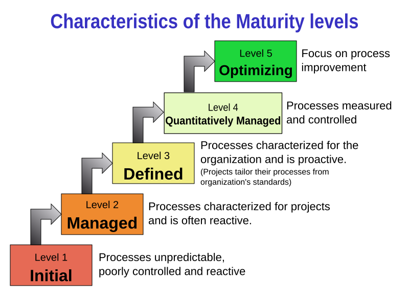
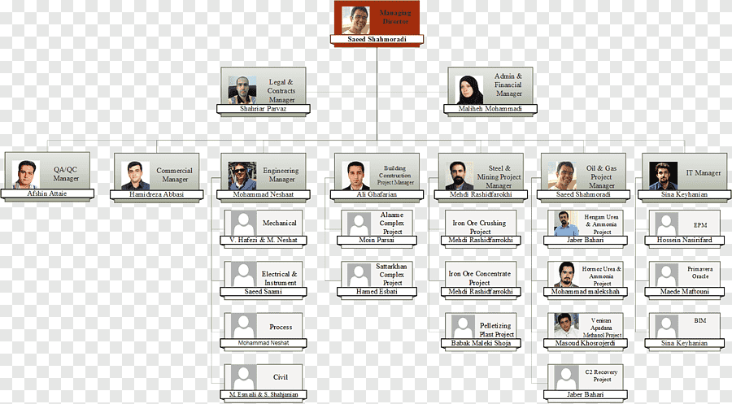

# ## **Chapter 8: SOFTWARE QUALITY ASSURANCE AND TESTING**

---

### **1. TESTING PRINCIPLES AND OBJECTIVES**

**What is Testing?**

- An iterative process carried out in conjunction with implementation.
- An investigation to provide stakeholders with information about product quality.
- The most common way to check that software meets its specification and customer needs.
- A critical element of software quality assurance — the ultimate review of specification, design, and code.

**Why Testing?**

- To improve quality
- To verify and validate
- For reliability estimation

**Objectives of Testing**

1. To demonstrate to the developer and customer that the software meets its requirements.
2. To discover faults or defects where the software behaves incorrectly, undesirably, or not according to its specification.

**Key Testing Principles** (you should know these)

| **Principle** | **Meaning** |
| --- | --- |
| **Traceability to requirements** | Every test should be traceable back to a specific customer requirement. |
| **Plan tests early** | Test planning should begin long before testing execution starts. |
| **Pareto principle** | 80% of all errors are likely to be traceable to 20% of program components. Focus on those suspect components. |
| **Start small, then integrate** | Testing begins at the unit level and progresses outward towards the integrated system. |
| **Exhaustive testing is impossible** | It’s impossible to test every combination of inputs. Use risk and priorities to select test cases. |

---

### **2. TEST PLAN**

A **test plan** is a document detailing a systematic approach to testing a system. It documents the strategy to verify that a product meets its design specifications and requirements. Usually prepared by or with significant input from Test Engineers.

**A test plan includes:**

- Introduction
- Assumptions
- List of test cases
- Features to be tested (and not tested)
- Testing approach (strategy)
- Deliverables to be tested
- Resources allocated
- Risks during testing
- Schedule of tasks and milestones

A test case is a set of conditions/variables under which a tester determines whether the system works correctly. A **test oracle** is the mechanism to decide pass/fail.

---

### **3. TYPES AND LEVELS OF TESTING**

**A. Types of Testing (by execution method)**

| **Type** | **Description** |
| --- | --- |
| **Manual Testing** | Tester executes test cases manually without automation tools, acting as an end user to identify unexpected behaviour. |
| **Automation Testing** | Tester writes scripts and uses software tools to re-run test scenarios quickly and repeatedly. |

**B. Testing Methods (by knowledge of internals)**

| **Method** | **Description** | **Example** |
| --- | --- | --- |
| **Black‑box** | Testing without any knowledge of internal workings. Focus on inputs and outputs. | User enters a value, checks the calculated output, but doesn't know the formula inside. |
| **White‑box (glass/clear)** | Testing with full knowledge of internal logic and code structure. | Tester checks specific loops, conditions, and paths in the source code. |
| **Grey‑box** | Testing with limited knowledge of internal workings. | Tester knows some database schema but not full code. |

**C. Levels of Testing**

Two main categories: **Functional** and **Non‑Functional**.

**Functional Testing**: based on specifications; tested by providing inputs and examining outputs.

1. **Unit Testing**
    - Performed by developers on individual units (functions, classes) of source code.
    - Goal: isolate each part and show that individual parts are correct.
    - Uses test data separate from QA team's data.
2. **Integration Testing**
    - Testing combined parts of an application to see if they function correctly together.
    - Two approaches:
        - **Bottom‑up**: Start with unit tests, then progressively combine modules.
        - **Top‑down**: Test highest‑level modules first, then progressively add lower‑level modules.
3. **System Testing**
    - Tests the complete, integrated system as a whole against quality standards.
    - Performed by a specialized testing team in an environment similar to production.
    - Verifies and validates both business requirements and application architecture.
4. **Acceptance Testing**
    - Conducted by QA team / client to gauge whether the application meets intended specs and client requirements.
    - Two types:
        - **Alpha testing**: Performed internally (developer + QA teams) combining unit, integration, system tests. Checks for spelling, broken links, performance on low‑spec machines.
        - **Beta testing**: A sample of intended users tests the application before release. Feedback on crashes, confusing flows, etc., is used to fix issues.

**Non‑Functional Testing**: tests attributes like performance, security, usability, portability.

- Performance Testing
- Usability Testing
- Security Testing
- Portability Testing

---

### **4. TEST STRATEGIES**

A strategy integrates low‑level tests (verifying small code segments) and high‑level tests (validating major system functions against customer requirements).

**Strategic Approach:**

- Testing begins at the component level and moves outward toward the integrated system.
- Different testing techniques are appropriate at different points in time.
- The developer conducts testing, possibly assisted by an independent test group to avoid conflict of interest (builder testing own product).
- Testing and debugging are different activities; debugging must be accommodated in the strategy.
- Distinction between **verification** and **validation** is essential.

A good strategy provides **guidance** for practitioners and **milestones** for managers, with progress that is measurable even under deadline pressure.

---

### **5. PROGRAM VERIFICATION AND VALIDATION (V&V)**

**Definitions**:

- **Verification**: "Are we building the product right?" – ensuring software correctly implements a specific function.
- **Validation**: "Are we building the right product?" – ensuring the built software is traceable to customer requirements.

**V&V Process**:

- A whole‑life‑cycle process applied at every stage of software development.
- **Two principal objectives**:
    1. Discovery of defects in the system.
    2. Assessment of whether the system is useful and usable in an operational situation.

**V&V Goals**:

- Establish confidence that the software is **fit for purpose**.
- This does NOT mean completely free of defects – it must be **good enough** for its intended use. The type of use determines the degree of confidence needed.

**V&V encompasses many SQA activities** (formal technical reviews, quality and configuration audits, performance monitoring, simulation, feasibility study, documentation review, algorithm analysis, development testing, qualification testing, installation testing, etc.).

---

### **6. SOFTWARE QUALITY**

**Defining Software Quality** (based on lecture quotes):

- The difficulty is translating future user needs into measurable characteristics, so a product gives satisfaction at a price the user will pay (Shewhart/Deming).
- Quality reflects:
    - **Conformance to functional requirements** (compliance with design/ specs).
    - **Meeting non‑functional requirements** (robustness, maintainability, reliability) – the degree to which software was produced correctly.
- Software quality measurement quantifies how well a product rates along dimensions like functionality, reliability, usability, efficiency, maintainability, portability (ISO 9126 idea, can be mentioned briefly).

---

### **7. SEI‑CMM (Capability Maturity Model)**

**SEI** (Software Engineering Institute) at Carnegie Mellon developed CMM to improve software development processes.

**CMM Structure**:

- **Maturity Levels**: 5‑level continuum from ad‑hoc to optimized.
- **Key Process Areas**: clusters of related activities that achieve a set of goals.
- **Goals**: summarize the states that must exist for a key process area to be effective.
- **Common Features**: practices to implement and institutionalize a key process area (commitment, ability, activities, measurement, verification).
- **Key Practices**: describe infrastructure and practice elements.

**The Five Maturity Levels**


- **Level 1 – Initial**: Ad‑hoc processes; success depends on individual efforts.
- **Level 2 – Repeatable**: Software project tracking, requirements management, realistic planning, configuration management in place; successful practices can be repeated.
- **Level 3 – Defined**: Standard software development and maintenance processes are integrated organization‑wide; a Software Engineering Process Group oversees processes; training programs ensure compliance.
- **Level 4 – Managed**: Metrics used to track productivity, processes, and products; performance is predictable, quality consistently high.
- **Level 5 – Optimising**: Focus on continuous process improvement; impact of new processes/technologies can be predicted and effectively implemented.

---

### **8. SQA ACTIVITIES**

Software Quality Assurance (SQA) is the process of evaluating product quality and enforcing adherence to standards and procedures. It encompasses the entire development process (requirements, design, coding, code reviews, change management, configuration management, testing, release management, product integration).

**Key SQA Activities** (list):

1. Formulating a quality management plan
2. Applying software engineering techniques
3. Conducting formal technical reviews
4. Applying a multi‑tiered testing strategy
5. Enforcing process adherence
6. Controlling change
7. Measuring impact of change
8. Performing SQA audits
9. Keeping records and reporting

SQA is organized into goals, commitments, abilities, activities, measurements, and verifications.

---

### **9. QA ORGANIZATION STRUCTURE**

The QA organizational structure must provide the QA manager with **direct organizational paths into every department**.

- **Small businesses**: assign QA responsibilities to someone in management, giving them authority to manage QA matters company‑wide and a reporting path to the executive level.
- Employees continue to report to their department manager for disciplinary and non‑QA matters, but report to the QA person on quality questions.

**Diagram: QA Organization Structure**


text

```
                  Executive
                      |
        ┌─────────────┼─────────────┐
        |             |             |
    Dept. Mgr     QA Manager    Dept. Mgr
    (staff)       (authority)    (staff)
        |             |             |
    Employees ←── QA reporting ──→ Employees
```

QA manager has a direct line into each department for quality matters, independent of regular departmental hierarchy.

---

### **10. SQA PLAN**

The SQA plan describes how quality assurance will be performed throughout the project. It includes:

| **Section** | **Contents** |
| --- | --- |
| **Management** | Place of SQA in the organization structure |
| **Documentation** | Each work product produced as part of the software process |
| **Standards, practices, conventions** | All applicable standards/practices and metrics to be collected |
| **Reviews and audits** | Overview of how reviews and audits will be conducted |
| **Problem reporting and corrective action** | Procedures for reporting, tracking, and resolving errors/defects; organizational responsibilities |
| **Test** | References test plan/procedure and defines test record keeping requirements |
| **Other** | Tools, SQA methods, change control, record keeping, training, risk managemen |

---

