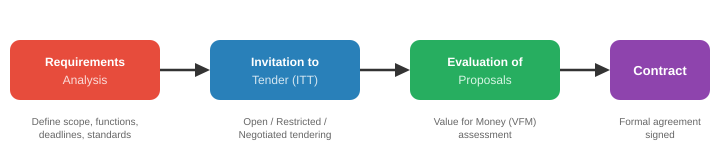
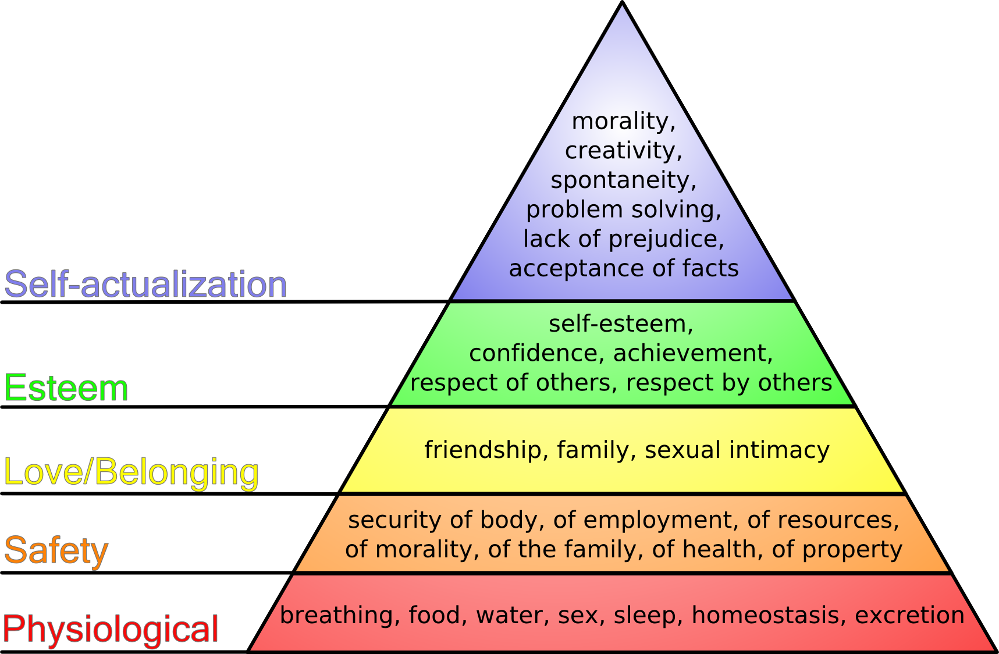
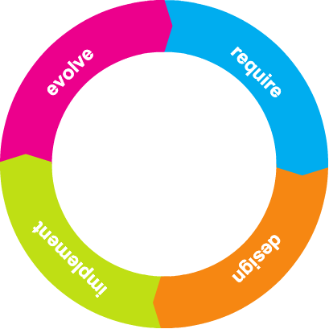
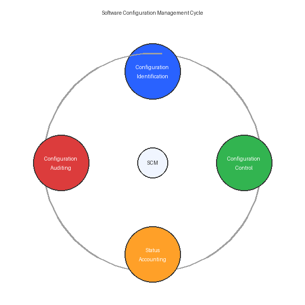

## **UNIT 1: INTRODUCTION TO SOFTWARE PROJECT MANAGEMENT**

**Figure: Syllabus Overview — Where Each Unit Fits**


---

### **1. Software Engineering Problem and Software Product, Software Product Attributes**

**Software Engineering Problem**

The core difficulty: software is invisible, highly complex, must conform to changing human rules, and is very easy to alter. These flow directly from the product's attributes.

**Software Product Attributes → Problems**

| **Attribute** | **Meaning** | **Resulting Problem** |
| --- | --- | --- |
| **Invisibility** | Progress and structure cannot be seen. *(e.g., you can’t “see” a code module’s completion % like you see a bridge pillar)* | → Poor estimates, unrealistic deadlines. |
| **Complexity** | Thousands of interacting logic paths per unit cost. *(e.g., even a small tax app has hundreds of rule combinations)* | → Incomplete specs, role confusion, hard quality measurement. |
| **Conformity** | Must fit volatile human rules and laws. *(e.g., payroll tax slabs change every budget year)* | → Moving targets, incorrect success criteria. |
| **Flexibility** | Change is cheap and easy. *(e.g., adding a “dark mode” toggle in a day)* | → Scope creep, outdated docs, baseline instability. |
| **Abstractness** | Pure thought‑stuff; no physical existence. | → Miscommunication, knowledge loss when staff leave. |
| **Intangibility of Process** | Development knowledge lives in people’s minds. | → Poor training, remote management gaps. |

---

### **2. Definition of a Software Project (SP)**

**Project** – A planned activity with:

Non-routine tasks, specific objectives, fixed time span, done for a client, multiple specialisms, phased execution, constrained resources, large/complex.

*Short contrast*:

- **Routine** → weekly server restart (not a project)
- **Project** → migrating the entire server to cloud in 3 months

**Software Project**

The whole lifecycle from early investigation to final implementation and maintenance, integrating all components (code, docs, training).

---

### **3. Software Project Vs. Other Types of Projects**

| **Aspect** | **Physical Project (e.g., road bridge)** | **Software Project (e.g., hospital management system)** |
| --- | --- | --- |
| **Visibility** | Progress visible (pillars rising). | Progress invisible (code completion not tangible). |
| **Complexity** | Governed by fixed physical laws. | Much higher logical complexity; no natural bounds. |
| **Conformity** | Must follow stable building codes. | Must follow changing laws, insurance rules, etc. |
| **Flexibility** | Changes are expensive. | Changes are easy → frequent modifications. |

---

### **4. Activities Covered by SPM**

**Figure 1: Feasibility – Plan – Execution Cycle**


**A. Feasibility Study** – Use **T‑O-E-S-L-i-P**

- **T**echnical – hardware/software available?
- **E**conomical – benefits > costs?
- **L**egal – data protection, licenses?
- **O**perational – will users accept it?
- **S**chedule – can it be done in time?
    
    *Short example*: For a food delivery app, ask: can servers handle 10,000 orders? Will revenue recover development cost within 2 years?
    

**B. Planning**

- Outline plan for the whole project; detailed plan only for immediate next stage.
- Later stages planned when closer (rolling wave).
    
    *Short example*: Phase‑1 (ordering) planned in detail now; Phase‑2 (loyalty points) detailed later, with better data.
    

**C. Project Execution**

Two sub‑phases:

- **Design** → UI, architecture, database.
- **Implementation** → real coding, integration.

**Full Lifecycle Flow**


- Maintenance types: Corrective (bugs), Adaptive (new platforms), Perfective (new features).

---

### **5. Categorising Software Projects**

**A. Information Systems vs. Embedded Systems**

| **Information System** | **Embedded System** |
| --- | --- |
| Interfaces with an **organisation**. | Interfaces with a **machine**. |
| Business logic focus. | Real‑time control focus. |
| *Example*: Payroll system, hotel reservation. | *Example*: Car anti‑lock braking software, AC temperature controller. |

**B. Objectives‑Driven vs. Product‑Driven**

| **Objectives‑Driven** | **Product‑Driven** |
| --- | --- |
| Aim is a **goal**. | Aim is a **specified product**. |
| Alternative solutions allowed. | Exact deliverable must be built. |
| *Example*: Brightmouth College – goal is cheaper payroll; if in‑house package isn’t cheaper, they can outsource. | *Example*: A custom passport‑issuing system with exact biometric specs. |

---

### **6. Project Management Cycle and SPM Framework**

**A. The 8 Management Activities (SPM Framework)**

| **Activity** | **Meaning (short illustration)** |
| --- | --- |
| **Planning** | Decide what to do *(e.g., create sprint schedule)* |
| **Organising** | Make arrangements *(e.g., book test environment)* |
| **Staffing** | Select right people *(e.g., hire a UI designer)* |
| **Directing** | Lead and instruct *(e.g., explain module requirements to a junior dev)* |
| **Monitoring** | Check progress *(e.g., daily stand‑up)* |
| **Controlling** | Correct deviations *(e.g., add devs to a delayed module)* |
| **Innovating** | Find new solutions *(e.g., use a new caching library to fix performance)* |
| **Representing** | Liaise with clients/management *(e.g., present status to steering committee)* |

**B. Project Control Cycle**

text

```
Real World (actual work) → Data collection → Data Processing (information) → Modelling → Decisions/Plans → Implementation → (back to Real World)
```

*Simple memory*: Measure → Compare → Decide → Act → Repeat.

*Short example*: Collect sprint hours, see delay, move one feature to next sprint, implement decision, remeasure.

**Figure: Stepwise Project Planning Framework**


---

### **7. Types of Project Plan**

| **Plan Type** | **Description *(short example in parentheses)*** |
| --- | --- |
| **Quality Plan** | Quality standards, reviews, tests *(e.g., 95% unit test coverage required)* |
| **Validation Plan** | Approach for testing and acceptance *(e.g., UAT in March with real hospital staff)* |
| **Configuration Management Plan** | Version control, change control *(e.g., Git for code; signed form to change requirements)* |
| **Maintenance Plan** | Post‑delivery effort & cost *(e.g., 2 devs for 6 months to handle tax updates)* |
| **Staff Development Plan** | Team skill improvement *(e.g., junior devs attend a cloud workshop)* |

## **UNIT 2: PROJECT ANALYSIS (Final Revision Notes)**

---

### **1. INTRODUCTION TO PROJECT ANALYSIS**

Project analysis is the process of examining every aspect of a proposed project *before* committing resources. It answers one core question: **"Is this project worth doing?"**

It sits inside the **Feasibility Study** (from Unit 1) and breaks down into three assessments:


---

### **2. STRATEGIC ASSESSMENT**

Strategic assessment evaluates whether the project aligns with the organisation's long-term goals. A project can be technically brilliant and financially profitable, but still wrong for the company.

**Key Questions:**

- Does this project support our business strategy?
- Does it provide competitive advantage?
- Is it the right time for this project?
- What happens if we *don't* do it?

**Link from old notes (the bit that fits here):**

- Step 1.2 of project planning: "Establish a project authority" → ensures unity of purpose.
- Step 1.3: "Identify all stakeholders and their interests" → a strategic project must serve stakeholder goals.
- Step 2.1: "Identify relationship between project and strategic planning" → where does this project fit among all other projects in the organisation?

**Simple example**: A small college wants to build an AI-powered student counselling chatbot. Technically possible, financially cheap, but strategically misaligned — their real priority is fixing the broken enrolment system. Project fails strategic assessment.

---

### **3. TECHNICAL ASSESSMENT**

Technical assessment asks: **"Do we have the capability to build and run this system?"**

**Areas assessed:**

| **Area** | **Key Question** | **Risk if Not Checked** |
| --- | --- | --- |
| **Hardware** | Are servers, network, devices available? | System cannot be deployed. |
| **Software** | Do we have the required development tools, databases, licenses? | Development stalls. |
| **Skills** | Does the team have the right expertise? | Poor quality product. |
| **Infrastructure** | Does the existing IT environment support the new system? | Integration failure. |
| **Operational fit** | Will the organisation be able to use and maintain it? | System goes unused. |

**Simple example**: A project to build a mobile banking app fails technical assessment because the bank's legacy mainframe cannot expose APIs that the app needs to consume.

**Link from old notes**: Step 2.2 "Identify installation standards and procedures" → ensures technical standards are followed. Step 3.5 "Select general lifecycle approach" → technical constraints may dictate waterfall vs agile.

---

### **4. ECONOMIC ANALYSIS (The main focus)**

This is the financial mathematics part. Every method here compares **cash inflows (benefits)** vs **cash outflows (costs)** over time, accounting for the **time value of money**.

> **Core concept**: Money today is worth more than money tomorrow (because today's money can earn interest).
> 

**Glossary of symbols you'll use throughout:**

| **Symbol** | **Meaning** |
| --- | --- |
| **P** | Present worth (value at time = 0) |
| **F** | Future worth (value at time = n) |
| **A** | Annual worth (equal amount recurring each period) |
| **G** | Uniform gradient (amount increasing by constant G each period) |
| **i** | Interest rate per period (decimal form, e.g., 10% = 0.10) |
| **n** | Number of periods (usually years) |

---

### **4.1 Present Worth (PW) Analysis**

**Concept**: Convert all future cash flows (inflows and outflows) to their equivalent value *right now* (time zero). The sum is the Net Present Worth (NPW) or Net Present Value (NPV).

**Formula**:

$$
P = F(1+i)^{-n} \quad \text{(Single future amount → Present)}
$$

$$
P = A \cdot \frac{(1+i)^n - 1}{i(1+i)^n} \quad \text{(Annual series → Present)}
$$

**Decision Rule**:

- **NPW > 0** → Project is financially acceptable (earns more than minimum required return).
- **NPW < 0** → Reject.
- For comparing alternatives → choose the one with **highest positive NPW**.

**Figure: Cash Flow Diagram for Present Worth**


**Simple example**: Invest Rs 1,00,000 now (P). Get Rs 40,000 per year for 3 years (A). Interest rate 10%.

- PW of inflows = 40,000 × [(1.1³ – 1) / (0.1 × 1.1³)] = 40,000 × 2.487 = Rs 99,480
- NPW = 99,480 – 1,00,000 = **– Rs 520** → Reject (just below zero).

---

### **4.2 Future Worth (FW) Analysis**

**Concept**: Convert all cash flows to their equivalent value at the *end* of the project's life (time n). Then compare.

**Formula**:

$$
F = P(1+i)^n \quad \text{(Single present amount → Future)}
$$

$$
F = A \cdot \frac{(1+i)^n - 1}{i} \quad \text{(Annual series → Future)}
$$

**Decision Rule**:

- If FW of benefits > FW of costs → Accept.
- For comparing alternatives → choose the one with **highest net future worth**.

**Simple example**: Same project as above. Find F worth of the Rs 1,00,000 investment after 3 years at 10%.

- F of investment = 1,00,000 × (1.1)³ = 1,33,100
- F of inflows = 40,000 × [(1.1³ – 1) / 0.1] = 40,000 × 3.31 = 1,32,400
- Net FW = 1,32,400 – 1,33,100 = **– Rs 700** → Reject. (Same decision as PW, just at a different point in time.)

---

### **4.3 Annual Worth (AW) Analysis**

**Concept**: Spread all cash flows (lumpy investments and returns) into an equivalent **equal annual amount** over the project life. This makes comparison easy, especially for projects with different lifetimes.

**Formula**:

$$
A = P \cdot \frac{i(1+i)^n}{(1+i)^n - 1} \quad \text{(Present worth → Annual series)}
$$

$$
A = F \cdot \frac{i}{(1+i)^n - 1} \quad \text{(Future worth → Annual series)}
$$

**Decision Rule**:

- If Net Annual Worth > 0 → Accept.
- For comparing alternatives → choose the one with **highest equivalent annual worth**.

**Simple example**: A machine costs Rs 5,00,000 today (P), lasts 5 years, has annual maintenance cost of Rs 20,000. Interest 12%.

- Annual cost of initial investment = 5,00,000 × [ (0.12 × 1.12⁵) / (1.12⁵ – 1) ] = 5,00,000 × 0.2774 = Rs 1,38,700
- Total annual cost = 1,38,700 + 20,000 = **Rs 1,58,700 per year**.
    
    This is the uniform annual cost of owning and operating the machine.
    

---

### **4.4 Internal Rate of Return (IRR) Method**

**Concept**: The IRR is the discount rate (i) at which the **Net Present Worth becomes exactly zero**. It represents the project's actual rate of return.

**Formula (conceptual)**:

Solve for i where:

$$
\text{PW}_{\text{inflows}} - \text{PW}_{\text{outflows}} = 0
$$

This usually requires trial-and-error or interpolation:

$$
IRR = i_1 + \frac{NPW_1}{NPW_1 - NPW_2} \times (i_2 - i_1)
$$

Where: i₁ = lower rate giving positive NPW; i₂ = higher rate giving negative NPW.

**Decision Rule**:

- **IRR > Minimum Acceptable Rate of Return (MARR)** → Accept.
- **IRR < MARR** → Reject.

**Simple example**: Invest Rs 10,000 now. Get Rs 12,000 after 2 years.

- Try i = 9%: PW = –10,000 + 12,000 / (1.09)² = –10,000 + 10,100 = +100 (positive)
- Try i = 10%: PW = –10,000 + 12,000 / (1.10)² = –10,000 + 9,917 = –83 (negative)
- IRR ≈ 9% + [100 / (100 + 83)] × 1% = 9.55% → If MARR is 8%, accept.

---

### **4.5 Benefit-Cost Ratio (BCR) Analysis**

**Concept**: Ratio of all discounted benefits to all discounted costs.

**Formula**:

$$
BCR = \frac{\text{PW of Benefits}}{\text{PW of Costs}}
$$

Or equivalently:

$$
BCR = \frac{\text{Equivalent Annual Benefits}}{\text{Equivalent Annual Costs}}
$$

**Decision Rule**:

- **BCR > 1** → Benefits exceed costs → Accept.
- **BCR = 1** → Break even.
- **BCR < 1** → Reject.
- For comparing alternatives → higher BCR is generally better, but care needed when project scales differ.

**Simple example**: A road project costs Rs 50 crore today. Benefits over 10 years have a PW of Rs 70 crore.

- BCR = 70 / 50 = **1.4** → Accept. For every Rs 1 spent, society gains Rs 1.40 in value.

---

### **4.6 Uniform Gradient Cash Flow**

**Concept**: Not all recurring cash flows are equal. Some increase or decrease by a **constant amount (G)** each period. For example, maintenance costs that rise by Rs 5,000 every year.

**Figure: Uniform Gradient Cash Flow**


**Conversion formulas** (gradient to present, then to annual):

$$
P = G \cdot \frac{(1+i)^n - i n - 1}{i^2(1+i)^n} \quad \text{(Gradient series → Present Worth)}
$$

$$
A = G \cdot \left( \frac{1}{i} - \frac{n}{(1+i)^n - 1} \right) \quad \text{(Gradient series → Annual Worth)}
$$

**Decision Use**: Use these formulas to convert a gradient series into an equivalent P or A, then plug into the PW, AW, or BCR method as needed.

**Simple example**: Maintenance cost is Rs 10,000 in Year 1, increasing by Rs 2,000 each year for 5 years (G = 2,000). Interest = 10%.

- Convert the gradient to equivalent annual cost:
- A = 2,000 × [ 1/0.1 – 5 / (1.1⁵ – 1) ] = 2,000 × [ 10 – 5/0.6105 ] = 2,000 × [ 10 – 8.19 ] = 2,000 × 1.81 = Rs 3,620
- Total equivalent annual cost = Base 10,000 + Gradient equivalent 3,620 = **Rs 13,620 per year**.

---

### **4.7 Comparison of Mutually Exclusive Alternatives**

When you must choose **only one** from several options (e.g., selecting one vendor, one machine, one location), you compare them on equal footing.

**Key principle**: Compare using the **same method** and the **same time horizon**.

**Methods for comparison (in order of reliability)**:

| **Method** | **How to Apply** | **Watch Out For** |
| --- | --- | --- |
| **Net PW** | Compute NPW for each alternative. Choose the one with **highest positive NPW**. | Must use same number of periods. If lives differ, use least common multiple (LCM) or AW instead. |
| **Annual Worth** | Compute AW for each alternative. Choose the one with **best AW** (highest for benefits, lowest for costs). | This is the cleanest method when alternatives have different lives — no need for LCM. |
| **IRR** | Compute IRR for each. The one with highest IRR may not be the best NPW choice. Use **Incremental IRR** analysis: compare the difference between two projects. | Never rank by IRR alone. Always do incremental analysis. |
| **BCR** | Compute BCR for each. Higher is better, but scale matters. | A tiny project can have a huge BCR but tiny absolute benefit. Use alongside NPW. |

**Step-by-step: Incremental IRR (when two projects have different IRRs)**

1. Order alternatives from lowest to highest initial cost.
2. Compute IRR of the cheaper one. If IRR > MARR, it qualifies as baseline.
3. Compute the **incremental cash flows**: (Costlier – Cheaper) for each year.
4. Compute IRR of the incremental cash flows.
5. If **Incremental IRR > MARR** → choose the costlier one (extra investment is justified).
6. If **Incremental IRR < MARR** → choose the cheaper one.

**Simple example**: Two machines, MARR = 10%.

- Machine A: Cost 1,00,000; Annual saving 20,000; Life 5 years.
- Machine B: Cost 1,50,000; Annual saving 32,000; Life 5 years.
- Incremental cost: 50,000; Incremental saving: 12,000/year.
- Find IRR of incremental: Try i = 20%: PW = –50,000 + 12,000 × [(1.2⁵–1)/(0.2×1.2⁵)] = –50,000 + 12,000 × 2.99 = –50,000 + 35,880 = –14,120 (negative). Try i = 6%: PW = –50,000 + 12,000 × 4.212 = +544 (positive).
- Incremental IRR ≈ 6.5%. Since 6.5% < MARR (10%), the extra investment in B is NOT justified → **Choose Machine A**.

## **UNIT 3: ACTIVITY PLANNING AND SCHEDULING**

---

### **1. OBJECTIVES OF ACTIVITY PLANNING**

Activity planning tells you **what to do, when to do it, and in what order**. The main objectives are:

| **Objective** | **What it means** | **Simple example** |
| --- | --- | --- |
| **Feasibility assessment** | Is the project possible within the given time and resource limits? | Can we deliver the library management system before the new academic session? |
| **Resource allocation** | What resources (people, equipment) are needed and when? | Need two Java developers in Phase 2, not from day one. |
| **Detailed costing** | How much will the project cost, and when will we spend the money? | Pay licences in Month 1, pay testers in Month 4. |
| **Motivation** | Clear targets with deadlines motivate the team, especially if they helped set those targets. | Developer commits to finishing the login module by Friday. |
| **Co-ordination** | When do different teams or departments need to be available and when can they leave? | Database team needed from Week 2 to Week 5; then they move to another project. |

> **Key idea**: Planning is not a one-time event. It is an ongoing process — you refine the plan as you get more information.
> 

---

### **2. WORK BREAKDOWN STRUCTURE (WBS)**

**Definition**: A hierarchical decomposition of the entire project scope into smaller, manageable pieces. The lowest level is called a **work package** — small enough to assign to a single person or small team.

**Structure** (IBM’s 5-level approach, from old notes):


*Simple example – Payroll Project:*

- Level 1: Payroll System
    - Level 2: Software, User Manual, Training Material
        - Level 3 (Software): Employee Module, Salary Calculation Module, Report Module
            - Level 4 (Employee Module): Database design, Input screens, CRUD operations
                - Level 5: "Create employee table", "Build add-employee form"

**Why WBS is essential**:

- It identifies *all* activities needed (nothing is forgotten).
- It helps estimate effort, assign responsibilities, and track progress.
- It is the foundation for building the schedule and network model.

> **Note**: Activity planning can also start from a Product Breakdown Structure (PBS) and Product Flow Diagram (PFD), but WBS is the most common and the one your syllabus explicitly names. Think of WBS as the skeleton of your plan.
> 

---

### **3. BAR CHART (GANTT CHART)**

A bar chart is a simple visual schedule. Activities are listed down the left, a time scale runs across the top, and horizontal bars show the start and end of each activity.

**Figure: Basic Bar Chart (Gantt Chart)**


text

```
Activity       | Week 1 | Week 2 | Week 3 | Week 4 | Week 5 |
---------------|--------|--------|--------|--------|--------|
A: Requirements|████████|        |        |        |        |
B: Design      |        |████████|        |        |        |
C: Coding      |        |        |████████|████    |        |
D: Testing     |        |        |        |  ██████|████    |
```

**Advantages**:

- Very easy to understand.
- Good for communicating the schedule to stakeholders.
- Shows start, end, and duration at a glance.

**Limitations**:

- Does **not** clearly show dependencies between activities (e.g., B depends on A).
- Does not show which activities are critical.

That is why we move to network models.

---

### **4. NETWORK PLANNING MODELS**

Network models represent activities and their dependencies as a graph. They allow us to calculate timings and find the **critical path**.

The three models you must know:

| **Model** | **Key Characteristic** |
| --- | --- |
| **CPM** (Critical Path Method) | Deterministic – activity durations are known, single values. |
| **PERT** (Program Evaluation & Review Technique) | Probabilistic – activity durations are uncertain, use three time estimates. |
| **PDM** (Precedence Diagramming Method) | Uses nodes for activities and allows **four types of dependencies** with lags. |

---

### **4.1 Critical Path Method (CPM)**

**When to use**: Routine projects where activity times are known from past experience.

**Key terms for each activity**:

| **Symbol** | **Meaning** | **Obtained by** |
| --- | --- | --- |
| **ES** | Earliest Start | Forward Pass |
| **EF** | Earliest Finish | ES + Duration |
| **LS** | Latest Start | Backward Pass |
| **LF** | Latest Finish | LS + Duration |
| **Float (Slack)** | Amount of delay allowed without delaying the project | $LS - ES$ (or $LF - EF$) |
| **Critical Path** | The path through the network where **Float = 0** for all activities | After forward & backward pass |

**Steps to apply CPM**:

1. List all activities and their durations.
2. Draw the network diagram (Activity-on-Node or Activity-on-Arrow). For simplicity, we use **Activity-on-Node** (each node is an activity, arrows show dependencies).
3. **Forward Pass** – Calculate ES and EF for every activity.
    - ES of first activity = 0.
    - EF = ES + Duration.
    - For a successor: ES = maximum EF of all its predecessors.
4. **Backward Pass** – Calculate LF and LS.
    - LF of last activity = its EF (or project deadline).
    - LS = LF – Duration.
    - For a predecessor: LF = minimum LS of all its successors.
5. Compute Float = LS – ES for each activity.
6. Identify the Critical Path: all activities with Float = 0.

**Figure: Simple CPM Network (Activity-on-Node)**


text

```
     [A]        [C]
    (2 days)   (3 days)
   /           \
Start --        >-- End
   \           /
    [B]       [D]
   (4 days)  (2 days)
```

*Precedence*: A must finish before C; B must finish before D; C and D finish the project.

**Example Calculation**:

Activity durations: A=2, B=4, C=3, D=2.

- Forward pass:
    - A: ES=0, EF=2
    - B: ES=0, EF=4
    - C: ES=EF(A)=2, EF=2+3=5
    - D: ES=EF(B)=4, EF=4+2=6
    - Project EF = max(5,6) = 6 days.
- Backward pass (project LF=6):
    - D: LF=6, LS=6-2=4
    - C: LF=6, LS=6-3=3
    - B: LF=LS(D)=4, LS=4-4=0
    - A: LF=LS(C)=3, LS=3-2=1
- Float: A: 1-0=1 (non-critical). B: 0-0=0 (critical). C: 3-2=1 (non-critical). D: 4-4=0 (critical).
- **Critical Path**: **B → D**. Project duration = 6 days.

---

### **4.2 Program Evaluation and Review Technique (PERT)**

**When to use**: Projects with uncertainty, where activity durations are hard to predict (e.g., R&D projects).

**Three time estimates per activity**:

| **Estimate** | **Symbol** | **Meaning** |
| --- | --- | --- |
| Optimistic | O | Best-case scenario, everything goes right. |
| Most Likely | M | Normal conditions, most realistic. |
| Pessimistic | P | Worst-case scenario, everything goes wrong. |

**Formulas**:

$$
TE = \frac{O + 4M + P}{6} \quad \text{(Expected Time)}
$$

$$
\sigma = \frac{P - O}{6} \quad \text{(Standard Deviation)}
$$

$$
\sigma^2 = \left(\frac{P - O}{6}\right)^2 \quad \text{(Variance)}
$$

**Project duration and probability**:

- Project expected time = Sum of TE along the critical path.
- Project variance = Sum of variances along the critical path.
- To find probability of finishing within a target deadline T:

$$
Z = \frac{T - TE_{\text{project}}}{\sqrt{\sigma^2_{\text{project}}}}
$$

Look up Z in the standard normal distribution table. A Z=1.0 means ~84% probability; Z=0 means 50%.

**Simple example**: Activity X: O=3, M=5, P=13

- TE = (3 + 4×5 + 13)/6 = (3+20+13)/6 = 36/6 = 6 days.
- σ = (13-3)/6 = 10/6 ≈ 1.67 days.
- If X is the only critical activity, probability of finishing in 7 days: Z = (7-6)/1.67 ≈ 0.6 → ~73%.

> **Exam tip**: CPM is deterministic (single duration), PERT is probabilistic (three estimates). Use CPM when past data exists, PERT when there is high uncertainty.
> 

---

### **4.3 Precedence Diagramming Method (PDM)**

PDM is a more flexible network model used by modern scheduling software (e.g., MS Project). It uses **Activity-on-Node** representation and allows **four types of dependencies** (relationships) with **lags**.

**Four Dependency Types**:

| **Type** | **Abbreviation** | **Meaning** | **Example** |
| --- | --- | --- | --- |
| **Finish-to-Start** | FS | Successor cannot start until predecessor finishes (standard CPM relationship). | Testing (B) cannot start until coding (A) finishes. |
| **Start-to-Start** | SS | Successor cannot start until predecessor has started (with possible lag). | Design documentation (B) can start 2 days after design (A) has started. |
| **Finish-to-Finish** | FF | Successor cannot finish until predecessor finishes (with possible lag). | System integration (B) cannot finish until module testing (A) finishes + 1 day for final checks. |
| **Start-to-Finish** | SF | Successor cannot finish until predecessor starts (rare). | Security guard duty (B) cannot finish until night shift (A) starts. |

**Lags**: A positive or negative time offset applied to a dependency.

- **+ Lag**: A delay (e.g., “start B 3 days after A finishes”).
- **– Lag (lead)**: An overlap (e.g., “start B 2 days before A finishes”).

**Figure: PDM with SS + Lag**


text

```
[A: Design] ----(SS + 2 days)----> [B: Write User Manual]
```

Meaning: B (manual writing) can start 2 days after A (design) has started.

**Why PDM is important**:

- Reflects real-world overlaps (e.g., coding can start before design is 100% complete).
- Much more realistic than simple Finish-to-Start only.
- Used in almost all professional project scheduling tools today.

---

### **5. IDENTIFYING CRITICAL ACTIVITIES**

**Critical activities** are those that **directly affect the project end date**. Any delay in a critical activity delays the whole project.

**How to identify**:

1. Perform forward and backward pass (CPM or PERT) for each activity.
2. Calculate **Total Float** = LS – ES.
3. Activities with **Total Float = 0** are critical.
4. The sequence of critical activities forms the **Critical Path**.

*From the CPM example earlier*:

- A: Float = 1 → not critical.
- B: Float = 0 → **critical**.
- C: Float = 1 → not critical.
- D: Float = 0 → **critical**.
- Critical path: B → D.

**Why this matters**:

- You know exactly where to focus management attention.
- If you need to shorten the project, you must shorten critical activities first.
- Non-critical activities have some slack — they can be delayed without harming the project end date (within their float).

---

### **6. SHORTENING PROJECT DURATION**

When the calculated project end date is too late, you must compress the schedule. Two main methods:

**A. Crashing**

- Add extra resources to critical activities to reduce their duration.
- **Cost increases**, but time decreases.
- Works only for activities that can be sped up by adding people/equipment (not all activities are "crashable" — e.g., "waiting for concrete to cure").
- Always recalculate the critical path after crashing, because a new path may become critical.

*Simple example*: A critical coding activity takes 10 days with 1 developer. Adding a second developer might reduce it to 6 days, but at extra cost.

**B. Fast-Tracking**

- Overlap activities that were originally planned in sequence (i.e., start a successor before the predecessor finishes).
- **Risk increases** (rework may be needed if predecessor changes), but time decreases.
- Often implemented using PDM with negative lags or SS dependencies.

*Simple example*: Start testing modules while the remaining modules are still being coded, instead of waiting for all coding to finish.

**General process**:

1. Identify the critical path.
2. Examine which critical activities can be crashed or overlapped.
3. Pick the most cost-effective and risk-manageable option.
4. Update the network and repeat if necessary.

---

## **UNIT 4: RISK MANAGEMENT**

---

### **1. INTRODUCTION TO RISK MANAGEMENT**

**Risk** – The possibility that something will happen that harms the project’s objectives (time, cost, quality).

**Risk Management** – A systematic process of identifying, analysing, and controlling risks before they become problems.

It answers three core questions:

- What can go wrong?
- How likely is it, and how bad will it be?
- What can we do about it?

---

### **2. NATURE OF RISK**

Understanding the nature of risk helps you categorise and respond to it correctly.

| **Aspect** | **Explanation** | **Simple Example** |
| --- | --- | --- |
| **Risk vs. Uncertainty** | Risk = you can predict probability and impact. Uncertainty = you cannot even guess. | Risk: 30% chance a key developer leaves (known event). Uncertainty: a new technology might appear next year and make your project obsolete. |
| **Negative vs. Positive Risk** | Most risks are threats (negative). Some are opportunities (positive). | Threat: server delivery delayed. Opportunity: a new tool could reduce testing time. |
| **Known vs. Unknown Risks** | Known = identified in advance. Unknown = emerge unexpectedly. | Known: integration bugs. Unknown: sudden regulatory change. |
| **Business vs. Project Risk** | Business: risk to the organisation’s benefit. Project: risk to project delivery. | Business: product may not sell. Project: missing a deadline. |
| **Common Software Project Risks** | High-level categories: personnel, technology, requirements, estimation, organisational. | New tech stack causing delays, client keeps changing requirements. |

---

### **3. IDENTIFICATION OF RISK**

This is the first practical step: find as many potential risks as possible.

**Common Identification Techniques**:

| **Technique** | **How It Works** | **Simple Example** |
| --- | --- | --- |
| **Brainstorming** | Team generates risks freely, no criticism. | Team lists everything that could go wrong with the new payroll system. |
| **Checklists** | Use a standard list of common software project risks. | Checklist item: "Are requirements stable?" |
| **Interviews** | Talk to experts, stakeholders, and experienced project managers. | Ask a senior architect about technical risks. |
| **SWOT Analysis** | Identify Strengths, Weaknesses, Opportunities, Threats. | Weakness: team inexperienced with cloud tech → risk. |
| **Assumption Analysis** | List all project assumptions and check what happens if they are wrong. | Assumption: third-party API will be ready by March. If not → delay. |
| **Diagramming** | Cause-and-effect (fishbone) diagrams to trace root causes. | Effect: project late. Causes: unclear specs, sick developer, slow hardware. |

**Risk Register (Output of Identification)**

A document listing every identified risk, its description, probability, impact, owner, and planned response. It is a living document updated throughout the project.

*Simple example entry:*

text

```
Risk ID: R01
Description: Lead developer may leave in the middle of coding.
Probability: Medium
Impact: High
Owner: Project Manager
Response: Cross-train another developer; maintain documentation.
```

---

### **4. RISK ANALYSIS**

After identification, we analyse each risk to prioritise it: **Probability × Impact**.

**A. Qualitative Risk Analysis**

Subjective, quick, uses descriptive scales.

| **Probability Scale** | **Impact Scale** |
| --- | --- |
| Low – Medium – High | Low – Medium – High |
| Very Low, Low, Moderate, High, Very High (1-5) | Same levels |

**Probability-Impact Matrix**


text

```
              Impact
              Low    Medium   High
Probability
High          Medium  High     Critical
Medium        Low     Medium   High
Low           Very Low Low     Medium
```

- **Critical/High**: Must act immediately.
- **Medium**: Monitor and plan response.
- **Low**: Accept or watch.

**B. Quantitative Risk Analysis**

Uses numbers. Tools include:

- **Expected Monetary Value (EMV)**: $EMV = \text{Probability} \times \text{Impact Cost}$.
    - Example: 20% chance of a Rs 5,00,000 loss → EMV = 0.2 × 500,000 = Rs 1,00,000.
- **Decision Trees**: Map different scenarios and their payoffs.
- **Schedule risk analysis using Z-values** (next section).

---

### **5. EVALUATION OF RISK TO THE SCHEDULE USING Z-VALUES**

This is a quantitative technique to answer: **"What is the probability that the project will miss its target deadline?"**

It comes directly from the **PERT** method (Unit 3). Instead of just one deterministic schedule, PERT gives us the project’s expected time (TE) and its variance. We can then use the **Z-value** to find the probability of finishing by any given deadline.

**Step-by-Step Process**:

1. For each activity on the critical path, have the three PERT estimates: Optimistic (O), Most Likely (M), Pessimistic (P).
2. Calculate **Expected Time (TE)** and **Variance (σ²)** for each critical activity:

    $$
    TE = \frac{O + 4M + P}{6}
    $$

    $$
    \sigma^2 = \left(\frac{P - O}{6}\right)^2
    $$
    
3. Calculate the **Project TE** = sum of TE of all critical activities.
4. Calculate the **Project Variance** = sum of σ² of all critical activities.
5. Compute the **Project Standard Deviation** = √(Project Variance).
6. For a target deadline **T**, calculate the **Z-value**:

    $$
    Z = \frac{T - TE_{\text{project}}}{\sigma_{\text{project}}}
    $$
    
7. Interpret Z using the standard normal distribution table (or remember key thresholds):
    - Z = 0 → 50% chance of finishing by T.
    - Z > 0 → more than 50% chance (project ahead or on time relative to target).
    - Z < 0 → less than 50% chance (project behind).

**Simple Example**:

A project has only two critical activities with the following estimates:

| **Activity** | **O** | **M** | **P** | **TE** | **σ²** |
| --- | --- | --- | --- | --- | --- |
| A | 5 | 10 | 15 | 10 | ((15-5)/6)² = (10/6)² ≈ 2.78 |
| B | 8 | 12 | 22 | 13 | ((22-8)/6)² = (14/6)² ≈ 5.44 |
- Project TE = 10 + 13 = 23 days.
- Project Variance = 2.78 + 5.44 = 8.22
- Project Standard Deviation = √8.22 ≈ 2.87 days.

The client demands completion in 25 days. What is the risk of exceeding 25 days?

text

```
Z = (25 - 23) / 2.87 ≈ 0.70
```

From normal table, Z=0.70 → ~75.8% probability of finishing **on or before** 25 days.

So the risk of **exceeding** 25 days = 100% – 75.8% ≈ **24.2%**.

If the target was 20 days:

text

```
Z = (20 - 23) / 2.87 ≈ -1.04 → ~15% probability of meeting deadline, 85% risk of delay.
```

**Why This Matters for Risk Management**:

- It turns schedule uncertainty into a numeric risk statement.
- You can decide if the probability of meeting a deadline is acceptable.
- If not acceptable, you must reduce risk (add resources, change scope, etc.).

**Exam Tip**: The Z-value method is the bridge between Unit 3 (PERT) and Unit 4 (Risk). You will likely have a numerical problem linking both

## **UNIT 5: RESOURCE ALLOCATION**

---

### **1. IDENTIFYING RESOURCE REQUIREMENTS**

Before you can allocate resources, you must identify **what** you need, **when**, and at **what level**.

**What is a Resource?**

Anything required to carry out project activities:

- **People** (developers, testers, designers, managers)
- **Equipment** (servers, laptops, software licences)
- **Materials** (cloud credits, test data)
- **Facilities** (office space, test lab)

**How to Identify Resource Requirements (Per Activity)**

For each activity in the WBS, specify:

| **Attribute** | **Meaning** | **Simple Example** |
| --- | --- | --- |
| **Work amount** | How much work (person-days, units) | 5 person-days to code login module |
| **Skill/experience level** | Minimum capability needed | Mid-level Java developer |
| **Complexity** | How difficult the task is (scale 1-5) | Complexity: 3 |
| **Task category** | Unskilled / Skilled / Expert / Leadership / Management | Category: Skilled |
| **Timing** | When the resource is needed (driven by activity ES/LS dates) | Needed in Week 3-4 |

**Who Does This?**

The **Project Manager** is responsible. Priority is given to resources that are **scarce or hard to find** (e.g., senior developers) — these must be planned far in advance.

---

### **2. RESOURCE ALLOCATION**

Resource allocation is the process of **assigning identified resources to project activities** in a way that respects both activity dependencies and resource constraints.

**Key Inputs**:

- Activity list with durations (from CPM/PERT)
- Resource requirements per activity
- Resource availability (who is free and when)

**Key Outputs (Three Schedules)**:

| **Schedule** | **Contents** |
| --- | --- |
| **Activity Schedule** | Planned start and finish date for each activity |
| **Resource Schedule** | Dates on which each resource is needed, and at what level |
| **Cost Schedule** | Planned cumulative expenditure over time |

**Prioritisation Techniques (Which activity gets the resource first?)**

When resources are limited, you must decide which activity gets priority.

**A. Total Float Priority**

- Activities with the **smallest total float** get resources first.
- Float = LS – ES (from CPM).
- Critical activities (float = 0) get highest priority.
- *Logic*: The least flexible activities must be protected.

**B. Ordered List Priority (Burman's Priority List)**

- Order of allocation:
    1. Shortest critical activity
    2. Other critical activities
    3. Shortest non-critical activity
    4. Non-critical activity with least float
    5. Remaining non-critical activities

**Important Consideration: Resource Allocation Can Change the Critical Path**

- Delaying an activity because a resource is unavailable eats up its float.
- Once float becomes zero, a new critical path can form.
- This is called a **resource-constrained critical path**.

**Figure: Resource Histogram**


text

```
People
   |
 5 |           ████████
 4 |       ████        ████
 3 |   ████                ████
 2 |███                        ████
 1 |                                ██
   |____________________________________ Week
        1    2    3    4    5    6    7
```

A resource histogram shows **how many people (or units of a resource) are needed each week**. White bars = scheduled work; shaded bars = float period.

---

### **3. RESOURCE SMOOTHENING**

**Definition**: Adjusting the start dates of non-critical activities (within their float) to **reduce peaks and troughs** in resource demand — **without** changing the project end date.

**Goal**: Achieve a more even, predictable resource usage profile.

**What you do**:

- Move a non-critical activity later (or earlier) within its available float.
- This shifts its resource demand to a less busy period.

**Simple Example**:

text

```
Before smoothening:            After smoothening:
Week 2: 3 devs (peak)           Week 2: 2 devs
Week 3: 1 dev                   Week 3: 2 devs
Week 4: 1 dev                   Week 4: 2 devs
```

Activity B has 2 weeks of float. It was scheduled in Week 2, but we delay it to Week 3. The peak drops from 3 to 2.

**Key Points**:

- Uses **only float** — the critical path and project end date remain unchanged.
- Ideal for situations where hiring/firing is expensive or you want stable team sizes.
- The resource histogram becomes flatter.

---

### **4. RESOURCE BALANCING (RESOURCE LEVELLING)**

**Definition**: When resource supply is **strictly limited**, you may need to delay activities **beyond their float** to stay within the resource limit. This **can** extend the project end date.

**Goal**: Ensure resource demand never exceeds available supply.

**What you do**:

- If two activities need the same scarce resource at the same time, and both are critical or have no float left, you must delay one — even if it means the project takes longer.

**Simple Example**:

text

```
Available: 2 Java developers maximum.
Week 3 demand: Activity P needs 1 dev, Activity Q needs 1 dev, Activity R needs 1 dev → 3 devs required.
Activity R has zero float (critical). You must delay one activity beyond its float.
Result: Project end date shifts by the delay.
```

**Resource Smoothing vs. Resource Balancing**

| **Aspect** | **Resource Smoothing** | **Resource Balancing** |
| --- | --- | --- |
| **Uses float** | Yes, only within available float | No, may exceed float |
| **Project end date** | Unchanged | May be extended |
| **Constraint** | Flatten resource usage | Hard limit on resource availability |
| **Priority** | Aesthetic/efficiency | Feasibility — must stay within resource cap |
| **When to use** | Resources flexible, want stability | Resources fixed, project must fit them |

---

### **5. ADDITIONAL POINTS (FROM OLD NOTES, STILL RELEVANT)**

**Human Resource Scheduling Issues**

When scheduling people, account for:

- Planned leave, public holidays
- Possible sick leave (unpredictable)
- Motivation and enthusiasm for the task (affects output)
- Workload and stress levels
- Stress outside work

**Resource Allocation Principles (Being Specific)**

- **Availability** – Is the person free when needed?
- **Criticality** – Assign experienced staff to critical path activities (reduces overrun risk).
- **Risk** – Assign best staff to highest-risk activities.
- **Training** – Assign junior staff to non-critical activities with slack, so they can learn.
- **Team Building** – Consider how individuals will work together as a team.

**Cost Categories**

- **Staff costs**: Salaries, social security, pension, holiday pay.
- **Overheads**: Office space, interest, travel, insurance.
- **Usage charges**: External contractors, leased equipment.

## **UNIT 6: MONITORING AND CONTROL**

---

### **1. INTRODUCTION**

Once the project is underway, the focus shifts from planning to **ensuring progress**.

Monitoring and control is a continuous cycle:

**Figure: Project Control Cycle**


**Simpler memory**: Measure → Compare → Decide → Act → Repeat.

**Purpose**:

- Track actual progress against the plan.
- Identify deviations early.
- Take corrective action to bring the project back on track.

**Checkpoints**: Essential to set review points in the activity plan.

- **Regular** (e.g., monthly review)
- **Event-driven** (e.g., upon completion of a key deliverable like a design document)

---

### **2. COLLECTING DATA**

Good control needs reliable, timely data.

**What to collect**:

- Actual start and finish dates of activities.
- Effort expended (person-hours/days).
- Estimate of remaining work (how much is left?).
- Issues and risks encountered.

**How to collect**:

| **Method** | **Description** | **Simple Example** |
| --- | --- | --- |
| **Weekly time sheets** | Staff record hours spent on each activity. | Developer logs 8 hours on module coding. |
| **Progress meetings** | Short, regular team meetings (e.g., Monday morning) to review what was done and what's next. | Each member reports: "Login module coding done, testing module starting." |
| **Partial completion reporting** | For long tasks, break into measurable sub-products and count completed items. | Number of screen layouts finished out of total 20. |
| **Traffic Light (RAG) reporting** | Instead of guessing % complete, team members give a colour status. | Green: on target. Amber: delayed but recoverable. Red: seriously off track, needs help. |

**Traffic Light Method Steps**:

1. Identify key (first-level) elements of work.
2. Break each into second-level constituent elements.
3. Assess each second-level element: Green / Amber / Red.
4. Review to arrive at first-level and overall assessment.

*Why use Traffic Light?* It avoids the false precision of "90% complete" and highlights problems early.

**Priority for Monitoring**: You cannot monitor everything equally. Prioritise:

- **Critical path activities** (delay = project delay)
- **Activities with no free float** (delay disrupts resource schedule)
- **High-risk activities** (most likely to overrun)
- **Activities using critical (scarce/expensive) resources**

---

### **3. VISUALIZING PROGRESS**

Raw data is hard to interpret. Visual tools make progress clear.

**A. Gantt Chart (Updated)**

- Original Gantt bars show planned dates.
- Add a second bar (or fill) to show actual progress.
- A "today" marker indicates current status.

**B. Slip Chart**

- A more striking variant of Gantt.
- As activities slip, the bar bends or extends to the right.
- The **more the slip line bends**, the greater the variation from the plan.

**Figure: Slip Chart Concept**


text

```
Activity A: Planned  |████████████|
             Actual  |██████████████░░░░|  (slipped by 2 weeks)
```

**C. Ball Chart**

- A very visual way of showing target vs. actual dates.
- Each activity has a circle containing:
    - Original schedule date
    - Revised target date (if any) or actual date when completed
- Only two dates ever appear: original + most recent target, or original + actual.
- Colour or shading indicates status (e.g., filled circle = completed).

*Simple example*:

text

```
Circle for "Design" shows:  "10 Mar / 15 Mar" (original / revised target)
Once completed, it shows:   "10 Mar / 17 Mar" (original / actual)
```

---

### **4. COST MONITORING**

Tracking what you are spending versus what you planned to spend.

**Components of cost**:

- Staff costs (salaries, benefits)
- Overheads (office, utilities, insurance)
- Usage charges (external contractors, rented equipment)

**Approach**:

- Record **actual expenditure** per time period (weekly/monthly).
- Compare against the **planned cumulative cost curve** (baseline).
- If actual spending is above the planned line, investigate why (overspending or work ahead of schedule?).

**Cost monitoring is not enough alone**: You could be under budget but behind schedule. That is why we need **Earned Value Analysis**.

---

### **5. EARNED VALUE ANALYSIS (EVA)**

EVA integrates **scope, schedule, and cost** into a single monitoring system. It tells you not just "how much did I spend?" but "how much value did I get for that spend?"

**Core Three Metrics**:

| **Metric** | **Full Name** | **Meaning** | **Simple Analogy** |
| --- | --- | --- | --- |
| **PV** | Planned Value | The budgeted cost of work that was **planned** to be done by now. | The road should have been 10 km by today (costing Rs 10 lakh). |
| **EV** | Earned Value | The budgeted cost of work **actually completed** by now. | The road is only 8 km, so value earned = 8 lakh. |
| **AC** | Actual Cost | The money **actually spent** to achieve the completed work. | You spent Rs 12 lakh to build that 8 km. |

**Derived Variances and Indices**:

| **Metric** | **Formula** | **Meaning** | **Interpretation** |
| --- | --- | --- | --- |
| **SV** (Schedule Variance) | $EV - PV$ | Are we ahead or behind schedule? | + good, – bad |
| **CV** (Cost Variance) | $EV - AC$ | Are we under or over budget? | + good, – bad |
| **SPI** (Schedule Performance Index) | $EV / PV$ | Schedule efficiency. | >1 ahead, <1 behind |
| **CPI** (Cost Performance Index) | $EV / AC$ | Cost efficiency. | >1 under budget, <1 over |

**Simple Example**:

- Planned: 4 modules in 4 weeks, budget Rs 4,00,000 (PV at Week 4 = 4,00,000).
- Actually completed: 3 modules (EV = 3,00,000).
- Actually spent: Rs 3,50,000 (AC = 3,50,000).
- SV = 3,00,000 – 4,00,000 = **–1,00,000** → behind schedule.
- CV = 3,00,000 – 3,50,000 = **–50,000** → over budget.
- SPI = 3/4 = 0.75 (<1, slow).
- CPI = 3,00,000/3,50,000 ≈ 0.86 (<1, spending more than earning).

**Forecasting with EVA**:

| **Forecast** | **Formula** | **Meaning** |
| --- | --- | --- |
| **EAC** (Estimate at Completion) | $BAC / CPI$ | What will the total project cost if current cost performance continues? |
| **ETC** (Estimate to Complete) | $EAC - AC$ | How much more money will be needed? |
| **TCPI** (To-Complete Performance Index) | $(BAC - EV) / (BAC - AC)$ | What CPI must we achieve on remaining work to stay within budget? |

*Where BAC = Budget at Completion (original total budget).*

*Continuing the example*: BAC = 4,00,000

- EAC = 4,00,000 / 0.86 ≈ Rs 4,65,116 (project will overrun by ~65,000).
- ETC = 4,65,116 – 3,50,000 = Rs 1,15,116 needed to finish.

**Figure: EVA S-Curve (PV, EV, AC over time)**


**Why EVA is Powerful**:

- Early warning system: SPI and CPI tell you the health of the project long before the deadline.
- Combines time and cost in one view.
- Enables realistic forecasting of final cost and completion date.

---

### **6. PROJECT CONTROL**

Once monitoring reveals a deviation, **control** action is taken to bring the project back on target.

**A. Shortening the Critical Path**

If the project is behind schedule, focus on critical activities (non-critical ones have float).

- **Crashing**: Add extra resources to critical tasks (cost increases, time reduces).
- **Fast-tracking**: Overlap critical tasks that were originally sequential (risk increases).

**B. Reconsider the Precedence Network**

- If shortening individual critical activities is not enough, re-examine dependencies.
- Can some Finish-to-Start constraints be relaxed? (e.g., start testing before all coding is complete).
- This is essentially revisiting the schedule logic.

**C. Change Control**

When requests for change come (and they will), a formal process prevents chaos.

1. **Submit** – Stakeholder requests a change.
2. **Review** – Project team assesses impact on scope, schedule, cost, and risk.
3. **Decide** – Change Control Board approves or rejects.
4. **Implement** – If approved, plans and schedules are updated, and the change is executed.
5. **Communicate** – All stakeholders are informed.

**Figure: Change Control Process Flow**


**Key Principle**: No change should be implemented without formal approval and impact analysis.

## **UNIT 7: MANAGING CONTRACTS AND PEOPLE**

---

### **PART A – MANAGING CONTRACTS**

---

### **1. Introduction**

Projects often acquire software from external suppliers. The software could be:

- **Tailored system** – built specially for the customer
- **Off‑the‑shelf** – bought ‘as is’
- **Customised off‑the‑shelf (COTS)** – core system is modified to fit customer needs

A contract legally binds both parties. The project manager must ensure the contract reflects the true requirements and expectations.

---

### **2. Types of Contract**

| **Contract Type** | **Meaning** | **Advantages for Customer** | **Disadvantages** |
| --- | --- | --- | --- |
| **Fixed Price** | A single agreed price for the whole job. | Known expenditure; supplier motivated to be cost‑effective. | Supplier builds in contingency → price may be higher; difficult to change requirements; threat to quality. |
| **Time and Materials** | Customer pays for actual effort at agreed rates. | Easy to change requirements; lack of price pressure can improve quality. | Customer absorbs all risk of poorly defined/ changing requirements; no supplier incentive to be cost‑effective. |
| **Fixed Price per Delivered Unit** | Price is set per measurable unit (e.g., per function point, per screen). | Transparent pricing; comparability; supplier still has cost‑effectiveness incentive. | Difficulty in measuring software size; handling changed vs. new requirements can be messy. |

> Note: Often a **licence to use** software is bought, not the software itself.
> 

---

### **3. Stages in Contract Placement**

The tendering process moves through a sequence:

**Figure: Contract Placement Flow**


text

```
Requirements Analysis → Invitation to Tender (ITT) → Evaluation of Proposals → Contract Award
```

- **Requirements document** must clearly specify:
    - Functions, inputs/outputs, standards, compatibility, quality needs (e.g., response times)
    - Mandatory vs. desirable features
    - Deadlines
- **Tendering approaches**:
    - **Open tendering** – any supplier can bid; all evaluated equally
    - **Restricted tendering** – only invited suppliers can bid; shortlist reduces as stages progress
    - **Negotiated procedure** – negotiate with one supplier (e.g., for extension of existing software)
- **Evaluation plan** is prepared beforehand to assess proposals objectively: reading proposals, interviews, demonstrations, site visits, practical tests. Focus is on **value for money (VFM)** – not just lowest price.
- **Memoranda of Agreement (MoA)** may be used: customer first requests technical proposals → agree on technical solution in MoA → then request priced tenders based on that MoA. This separates technical and commercial evaluation.

---

### **4. Typical Terms of a Contract (Contract Checklist)**

| **Term** | **What it covers** |
| --- | --- |
| **Definitions** | Precise meaning of words like ‘supplier’, ‘user’, ‘application’. |
| **Form of agreement** | Is it a sale, lease, or licence? Can licence be transferred? |
| **Goods and services** | Detailed specification of what is to be supplied. |
| **Timetable of activities** | Delivery milestones and dates. |
| **Payment arrangements** | Payments tied to completion of specific tasks/milestones. |
| **Ownership of software** | Can client sell to others? Does supplier retain copyright? Escrow – source code deposited with third party in case supplier fails. |
| **Environment** | Where equipment is installed, site preparation, electricity, etc. |
| **Customer commitments** | Access, information, staff time that the customer must provide. |
| **Standards to be met** | Quality standards, documentation standards, etc. |
| **Acceptance criteria** | How the customer will test and formally accept the deliverables. |

---

### **5. Contract Management**

Ongoing management of the contract ensures both sides meet obligations. Key aspects:

- **Progress reporting** – regular status reports from supplier
- **Decision points** – linked to payments or phase approvals
- **Variations (changes)** – how changes to requirements are handled (formal change control)
- **Quality reviews** – joint review meetings
- **Acceptance** – final sign‑off procedure, often after successful acceptance testing

---

### **PART B – MANAGING PEOPLE AND ORGANIZING TEAMS**

---

### **1. Introduction**

People are an organisation’s most important asset. A manager’s activities around people include:

- Problem solving, motivating, planning, estimating, controlling, organising.

---

### **2. Understanding Behaviour – Organisational Behaviour Background**

**A. Human Needs Hierarchy (Maslow)**


text

```
      Self-
   Realization
  Esteem Needs
 Social Needs
Safety Needs
Physiological Needs
```

- People are motivated by unmet needs. Lower‑level needs (pay, safety) must be satisfied before higher‑level ones (esteem, growth) become motivating.

**B. Personality Types** – Three orientations that affect motivation:

- **Task‑oriented** – motivated by the work itself; loves the challenge.
- **Self‑oriented** – works to achieve personal goals (money, status, recognition).
- **Interaction‑oriented** – motivated by being around colleagues; social workplace is key.

A balanced team needs a mix of all three. An all‑task team may lack collaboration; an all‑self team may have power struggles; an all‑interaction team may chat more than work.

---

### **3. Selecting the Right Person for the Job**

Selection is based on:

- **CV/Resume** – experience, education, skills
- **Interview** – personal interaction, attitude, communication
- **References** – past performance
- Sometimes **psychological/aptitude tests** (usefulness debated)

**Key Staff Selection Factors** (simplified from the table):

| **Factor** | **Importance** |
| --- | --- |
| **Application domain experience** | Critical – developers must understand the business area. |
| **Communication ability** | Very important – must interact with team, managers, customers. |
| **Adaptability / Attitude** | Indicates ability to learn and positive approach. |
| **Programming language/ Platform experience** | Relevant mainly for short‑duration projects where there’s no time to learn. |
| **Educational background** | Shows fundamentals and learning ability; becomes less important with experience. |
| **Personality** | Must be compatible with team; no single type is “best”. |

---

### **4. Instruction in the Best Methods**

This refers to ensuring that staff are trained in and follow **the most effective work methods**. In practice it means:

- Defining standard development processes (e.g., coding standards, review procedures)
- Providing training and mentoring so team members know *how* to do their tasks correctly
- Using frameworks like the **People Capability Maturity Model (PCMM)** to systematically improve workforce skills.

**PCMM (5 levels)** – a roadmap for improving people management:

1. **Initial** – ad‑hoc people practices
2. **Repeatable** – basic policies for skill development
3. **Defined** – standardised people management across the organisation
4. **Managed** – quantitative goals for people competencies
5. **Optimising** – continuous improvement of individual competence and motivation

---

### **5. Motivation**

A manager must actively motivate the team. Key motivators are linked to:

- **Basic needs** (salary, job security)
- **Personal needs** (respect, recognition, growth)
- **Social needs** (belonging, teamwork)

**Practical ways to motivate**:

- Set clear, achievable targets
- Involve people in decision‑making
- Recognize and reward good work
- Provide opportunities to learn and advance

---

### **6. Working in Groups → Becoming a Team**

Most software work is group‑based. Group effectiveness depends on:

**A. Group Composition**

- Avoid groups where all members share the same personality type.
- An effective group balances task‑oriented, self‑oriented, and interaction‑oriented people.

**B. Group Cohesiveness**

- A cohesive group values the group above individuals.
- Benefits: shared quality standards, reduced fear of asking questions, learning from each other, egoless programming (constructive peer reviews).

**C. Group Communications**

- Good communication is essential for sharing design decisions and status.
- Factors that affect communication:
    - **Status differences** – higher‑status members may dominate; must encourage open exchange.
    - **Gender mix** – mixed‑sex groups tend to communicate better.
    - **Channels** – avoid channelling all communication through a central person; encourage direct communication.

**D. Team Formation – Becoming a Team**

Teams evolve through stages (Tuckman’s model – you can mention for context):

- Forming → Storming → Norming → Performing.
- The goal is to reach **Performing**, where the team works smoothly with high trust and productivity.

---

### **7. Decision Making**

In a project environment, decisions are needed constantly – technical choices, priority calls, risk responses.

**Decision‑making approaches**:

- **Autocratic** – manager decides alone; fast but may miss input.
- **Consultative** – manager gathers input, then decides; balances speed and participation.
- **Consensus** – the group discusses until everyone agrees; high buy‑in but time‑consuming.
- **Delegated** – decision is pushed to the expert or sub‑team; good for technical matters.

**Factors influencing choice**: urgency, importance, team expertise, and impact on motivation. Involving the team in decisions that affect them improves commitment.

---

### **8. Leadership**

Leadership is based on **respect, not just title**. On a software project, two leadership roles often emerge:

| **Role** | **Responsibility** |
| --- | --- |
| **Technical leader** | Guides architecture, design, coding standards; earns respect through competence. |
| **Managerial leader** | Handles planning, resources, communication with stakeholders. |

A healthy organisation supports a **career path for technical competence**, so good engineers don’t have to become managers to advance.

Good leaders:

- Communicate a clear vision
- Empower team members
- Remove obstacles
- Act with integrity

---

### **9. Organizational Structures**

How project teams and authority are arranged.

**A. Team Structures** (from lecture notes)

- **Small informal teams** (< 8 members) – democratic, everyone contributes; suitable for small projects.
- **Chief programmer team** – a highly skilled chief programmer designs and codes the critical parts; supported by specialists (librarian, tester). Works well for technically complex projects.
- **Break large projects** into multiple small teams, each responsible for a subsystem.

**B. Broader Organizational Structures** (briefly added for completeness)

- **Functional** – staff grouped by speciality (development, testing, design). Project manager borrows members.
- **Project‑based** – dedicated team assigned full‑time to the project; project manager has full authority.
- **Matrix** – staff report to both a functional manager and a project manager. Balances resource utilisation and project focus, but can cause dual‑command conflicts.

---

## **UNIT 8: SOFTWARE QUALITY ASSURANCE AND TESTING**

---

### **1. TESTING PRINCIPLES AND OBJECTIVES**

**What is Testing?**

- An iterative process carried out in conjunction with implementation.
- An investigation to provide stakeholders with information about product quality.
- The most common way to check that software meets its specification and customer needs.
- A critical element of software quality assurance — the ultimate review of specification, design, and code.

**Why Testing?**

- To improve quality
- To verify and validate
- For reliability estimation

**Objectives of Testing**

1. To demonstrate to the developer and customer that the software meets its requirements.
2. To discover faults or defects where the software behaves incorrectly, undesirably, or not according to its specification.

**Key Testing Principles** (you should know these)

| **Principle** | **Meaning** |
| --- | --- |
| **Traceability to requirements** | Every test should be traceable back to a specific customer requirement. |
| **Plan tests early** | Test planning should begin long before testing execution starts. |
| **Pareto principle** | 80% of all errors are likely to be traceable to 20% of program components. Focus on those suspect components. |
| **Start small, then integrate** | Testing begins at the unit level and progresses outward towards the integrated system. |
| **Exhaustive testing is impossible** | It’s impossible to test every combination of inputs. Use risk and priorities to select test cases. |

---

### **2. TEST PLAN**

A **test plan** is a document detailing a systematic approach to testing a system. It documents the strategy to verify that a product meets its design specifications and requirements. Usually prepared by or with significant input from Test Engineers.

**A test plan includes:**

- Introduction
- Assumptions
- List of test cases
- Features to be tested (and not tested)
- Testing approach (strategy)
- Deliverables to be tested
- Resources allocated
- Risks during testing
- Schedule of tasks and milestones

A test case is a set of conditions/variables under which a tester determines whether the system works correctly. A **test oracle** is the mechanism to decide pass/fail.

---

### **3. TYPES AND LEVELS OF TESTING**

**A. Types of Testing (by execution method)**

| **Type** | **Description** |
| --- | --- |
| **Manual Testing** | Tester executes test cases manually without automation tools, acting as an end user to identify unexpected behaviour. |
| **Automation Testing** | Tester writes scripts and uses software tools to re-run test scenarios quickly and repeatedly. |

**B. Testing Methods (by knowledge of internals)**

| **Method** | **Description** | **Example** |
| --- | --- | --- |
| **Black‑box** | Testing without any knowledge of internal workings. Focus on inputs and outputs. | User enters a value, checks the calculated output, but doesn't know the formula inside. |
| **White‑box (glass/clear)** | Testing with full knowledge of internal logic and code structure. | Tester checks specific loops, conditions, and paths in the source code. |
| **Grey‑box** | Testing with limited knowledge of internal workings. | Tester knows some database schema but not full code. |

**C. Levels of Testing**

Two main categories: **Functional** and **Non‑Functional**.

**Functional Testing**: based on specifications; tested by providing inputs and examining outputs.

1. **Unit Testing**
    - Performed by developers on individual units (functions, classes) of source code.
    - Goal: isolate each part and show that individual parts are correct.
    - Uses test data separate from QA team's data.
2. **Integration Testing**
    - Testing combined parts of an application to see if they function correctly together.
    - Two approaches:
        - **Bottom‑up**: Start with unit tests, then progressively combine modules.
        - **Top‑down**: Test highest‑level modules first, then progressively add lower‑level modules.
3. **System Testing**
    - Tests the complete, integrated system as a whole against quality standards.
    - Performed by a specialized testing team in an environment similar to production.
    - Verifies and validates both business requirements and application architecture.
4. **Acceptance Testing**
    - Conducted by QA team / client to gauge whether the application meets intended specs and client requirements.
    - Two types:
        - **Alpha testing**: Performed internally (developer + QA teams) combining unit, integration, system tests. Checks for spelling, broken links, performance on low‑spec machines.
        - **Beta testing**: A sample of intended users tests the application before release. Feedback on crashes, confusing flows, etc., is used to fix issues.

**Non‑Functional Testing**: tests attributes like performance, security, usability, portability.

- Performance Testing
- Usability Testing
- Security Testing
- Portability Testing

---

### **4. TEST STRATEGIES**

A strategy integrates low‑level tests (verifying small code segments) and high‑level tests (validating major system functions against customer requirements).

**Strategic Approach:**

- Testing begins at the component level and moves outward toward the integrated system.
- Different testing techniques are appropriate at different points in time.
- The developer conducts testing, possibly assisted by an independent test group to avoid conflict of interest (builder testing own product).
- Testing and debugging are different activities; debugging must be accommodated in the strategy.
- Distinction between **verification** and **validation** is essential.

A good strategy provides **guidance** for practitioners and **milestones** for managers, with progress that is measurable even under deadline pressure.

---

### **5. PROGRAM VERIFICATION AND VALIDATION (V&V)**

**Definitions**:

- **Verification**: "Are we building the product right?" – ensuring software correctly implements a specific function.
- **Validation**: "Are we building the right product?" – ensuring the built software is traceable to customer requirements.

**V&V Process**:

- A whole‑life‑cycle process applied at every stage of software development.
- **Two principal objectives**:
    1. Discovery of defects in the system.
    2. Assessment of whether the system is useful and usable in an operational situation.

**V&V Goals**:

- Establish confidence that the software is **fit for purpose**.
- This does NOT mean completely free of defects – it must be **good enough** for its intended use. The type of use determines the degree of confidence needed.

**V&V encompasses many SQA activities** (formal technical reviews, quality and configuration audits, performance monitoring, simulation, feasibility study, documentation review, algorithm analysis, development testing, qualification testing, installation testing, etc.).

---

### **6. SOFTWARE QUALITY**

**Defining Software Quality** (based on lecture quotes):

- The difficulty is translating future user needs into measurable characteristics, so a product gives satisfaction at a price the user will pay (Shewhart/Deming).
- Quality reflects:
    - **Conformance to functional requirements** (compliance with design/ specs).
    - **Meeting non‑functional requirements** (robustness, maintainability, reliability) – the degree to which software was produced correctly.
- Software quality measurement quantifies how well a product rates along dimensions like functionality, reliability, usability, efficiency, maintainability, portability (ISO 9126 idea, can be mentioned briefly).

---

### **7. SEI‑CMM (Capability Maturity Model)**

**SEI** (Software Engineering Institute) at Carnegie Mellon developed CMM to improve software development processes.

**CMM Structure**:

- **Maturity Levels**: 5‑level continuum from ad‑hoc to optimized.
- **Key Process Areas**: clusters of related activities that achieve a set of goals.
- **Goals**: summarize the states that must exist for a key process area to be effective.
- **Common Features**: practices to implement and institutionalize a key process area (commitment, ability, activities, measurement, verification).
- **Key Practices**: describe infrastructure and practice elements.

**The Five Maturity Levels**


- **Level 1 – Initial**: Ad‑hoc processes; success depends on individual efforts.
- **Level 2 – Repeatable**: Software project tracking, requirements management, realistic planning, configuration management in place; successful practices can be repeated.
- **Level 3 – Defined**: Standard software development and maintenance processes are integrated organization‑wide; a Software Engineering Process Group oversees processes; training programs ensure compliance.
- **Level 4 – Managed**: Metrics used to track productivity, processes, and products; performance is predictable, quality consistently high.
- **Level 5 – Optimising**: Focus on continuous process improvement; impact of new processes/technologies can be predicted and effectively implemented.

---

### **8. SQA ACTIVITIES**

Software Quality Assurance (SQA) is the process of evaluating product quality and enforcing adherence to standards and procedures. It encompasses the entire development process (requirements, design, coding, code reviews, change management, configuration management, testing, release management, product integration).

**Key SQA Activities** (list):

1. Formulating a quality management plan
2. Applying software engineering techniques
3. Conducting formal technical reviews
4. Applying a multi‑tiered testing strategy
5. Enforcing process adherence
6. Controlling change
7. Measuring impact of change
8. Performing SQA audits
9. Keeping records and reporting

SQA is organized into goals, commitments, abilities, activities, measurements, and verifications.

---

### **9. QA ORGANIZATION STRUCTURE**

The QA organizational structure must provide the QA manager with **direct organizational paths into every department**.

- **Small businesses**: assign QA responsibilities to someone in management, giving them authority to manage QA matters company‑wide and a reporting path to the executive level.
- Employees continue to report to their department manager for disciplinary and non‑QA matters, but report to the QA person on quality questions.

**Diagram: QA Organization Structure**


text

```
                  Executive
                      |
        ┌─────────────┼─────────────┐
        |             |             |
    Dept. Mgr     QA Manager    Dept. Mgr
    (staff)       (authority)    (staff)
        |             |             |
    Employees ←── QA reporting ──→ Employees
```

QA manager has a direct line into each department for quality matters, independent of regular departmental hierarchy.

---

### **10. SQA PLAN**

The SQA plan describes how quality assurance will be performed throughout the project. It includes:

| **Section** | **Contents** |
| --- | --- |
| **Management** | Place of SQA in the organization structure |
| **Documentation** | Each work product produced as part of the software process |
| **Standards, practices, conventions** | All applicable standards/practices and metrics to be collected |
| **Reviews and audits** | Overview of how reviews and audits will be conducted |
| **Problem reporting and corrective action** | Procedures for reporting, tracking, and resolving errors/defects; organizational responsibilities |
| **Test** | References test plan/procedure and defines test record keeping requirements |
| **Other** | Tools, SQA methods, change control, record keeping, training, risk managemen |

---

## **UNIT 9: SOFTWARE CONFIGURATION MANAGEMENT (SCM)**

---

### **1. INTRODUCTION TO SCM**

**What is Software Configuration Management?**

SCM is the discipline of **identifying, organizing, and controlling** changes to software products throughout the project lifecycle. It ensures that everyone works with the correct versions of all project artifacts and that changes are managed systematically.

**Think of SCM as the "librarian" of the project** — it knows where everything is, who changed what, when, and why.

**Key Goal**: Maintain the **integrity** and **traceability** of the software product as it evolves.

**What is a Configuration?**

The complete set of software products (code, documents, test data, manuals, etc.) at a specific point in time, along with their relationships.

---

### **2. NEED FOR SCM**

Why is SCM essential in a software project?

| **Problem SCM Solves** | **Explanation** |
| --- | --- |
| **Multiple developers changing the same code** | Without control, changes overwrite each other, causing lost work and bugs. |
| **Inability to revert to a stable version** | If a change breaks the system, you must be able to go back to the last working state. |
| **Confusion over which version is "current"** | Stakeholders need to know exactly which build is being tested, delivered, or deployed. |
| **Uncontrolled changes (scope creep)** | Changes made without authorization or impact analysis can derail the project. |
| **Parallel development (branching)** | Different versions (e.g., maintenance release vs. new feature development) must be managed simultaneously. |
| **Audit and accountability** | You need to know who made what change and why, for reviews and compliance. |

**Without SCM, a project can quickly descend into chaos** — duplicate effort, lost code, broken builds, and angry customers.

---

### **3. BASIC CONFIGURATION CONCEPTS**

**A. Configuration Item (CI)**

A CI is any work product that is placed under configuration control. Examples:

- Source code files
- Requirements specifications
- Design documents
- Test plans and test cases
- User manuals
- Build scripts and configuration files

**B. Baseline**

A baseline is a **formally reviewed and agreed-upon set of CIs** that serves as a fixed reference point for further development. Once baselined, changes can only be made through a formal change control process.

**Figure: Baselines through the lifecycle**


text

```
Requirements ── Baseline 1 ── Design ── Baseline 2 ── Coding ── Baseline 3 ── Testing ── Baseline 4 (Release)
```

- **Baseline 1**: Requirements specification approved.
- **Baseline 2**: Design documents approved.
- **Baseline 3**: Code frozen for testing.
- **Baseline 4**: Final tested product released.

**C. Version vs. Revision vs. Release**

- **Version**: A specific instance of a CI at a given point in time (e.g., v1.0, v1.1).
- **Revision**: A minor change to a version (e.g., bug fix).
- **Release**: A version distributed to customers.

**D. Repository (or Library)**

A central database that stores all CIs and their change history. Developers "check out" items, modify them, and "check in" the updated versions. Tools: Git, SVN, etc.

**E. Branching and Merging**

- **Branch**: A separate line of development (e.g., a feature branch, a bug-fix branch).
- **Merge**: Combining changes from one branch back into another (e.g., merging a completed feature into the main line).

---

### **4. MANAGEMENT RESPONSIBILITIES IN SCM**

SCM involves four main activities that form a continuous cycle:



**1. Configuration Identification**

- Define what CIs are under SCM.
- Establish naming conventions and version numbering schemes.
- Define baselines.
- Identify the structure of the product (e.g., using a Product Breakdown Structure).

**2. Configuration Control (Change Control)**

- Evaluate, approve, and track all changes to baselined CIs.
- Use a **Change Control Board (CCB)** to review change requests.
- A formal change request goes through:
    - Submission → Impact analysis → CCB decision (approve/reject/defer) → Implementation → Verification → Update records.

**3. Configuration Status Accounting**

- Record and report the current status of each CI (e.g., "checked out", "in review", "approved", "baselined").
- Provide traceability: who changed what, when, and why.
- Generate reports for management on the state of the configuration.

**4. Configuration Auditing**

- Verify that the actual configuration matches the documented configuration.
- Two types:
    - **Physical audit**: Does the actual product (code, docs) match the baseline specification?
    - **Functional audit**: Does the product meet the functional requirements defined in the baseline?
- Ensures that SCM processes are being followed correctly.